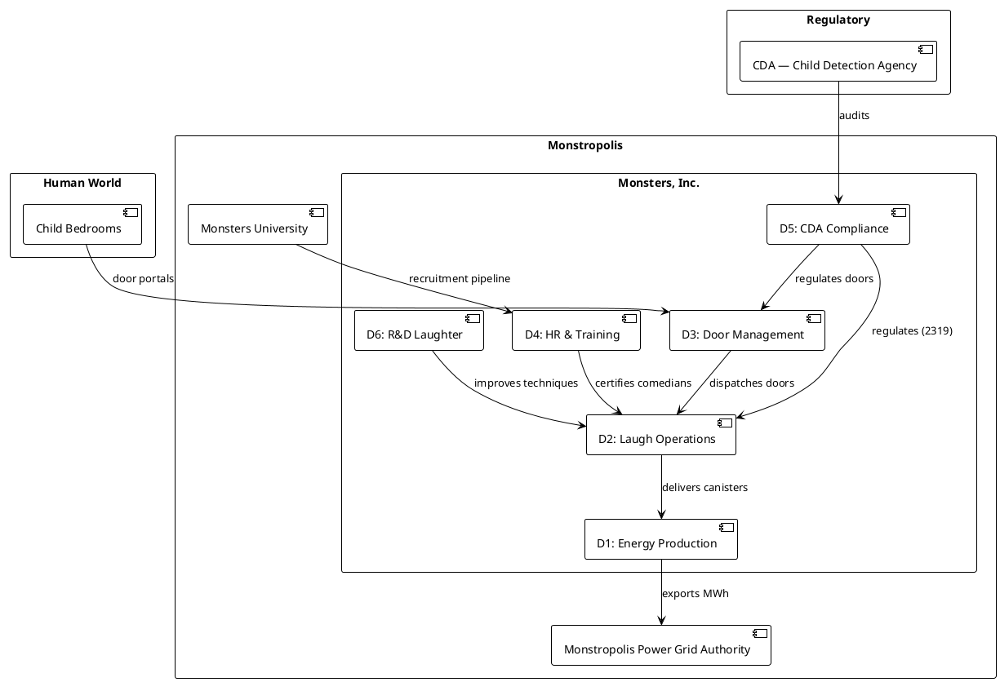

# Monsters, Inc. Enterprise Architecture

> A complete open-standards enterprise model of Monsters, Inc. (Pixar) — demonstrating OWL 2,
> SKOS, SHACL, SPARQL, PROV-O, DCAT 3, R2RML, W3C ODRL, and ArchiMate.
> Extended into an **agent-grade** model: machine-checkable authority, human-in-the-loop
> escalation, data governance, human-wellbeing analytics, and a queryable company constitution.
> Built to show the direction of travel for MS IQ.

## Just exploring? (no setup required)

This repo accompanies a blog post and is meant to be browsable by everyone — you do
**not** need Python, a SPARQL engine, or a PlantUML server to look around:

- **[Guided tour →](docs/00-overview.md)** — 16 short, illustrated views (domains,
  capabilities, processes, data catalog, governance, the company "constitution", …).
  Every diagram is embedded as an image, so it renders directly on GitHub.
- **[All diagrams →](images/diagrams/)** — every architecture diagram as a PNG.
- **[Question → query → answer cards →](images/)** — each of the 52 example questions
  as a single image showing the plain-English question, the SPARQL that answers it, and
  the result table. See *what the model can tell you* without running anything.

Want to run it yourself? See **Quick Start** below.

## Quick Start

```bash
uv sync         # install dependencies
make hooks      # (once) install the pre-commit lint hook (ruff + black)
make seed       # load example data (25 monsters, 50 doors, performance records)
make ontology   # generate the core .ttl ontology files
make validate   # SHACL validation — shows 3 intentional violations, names each
make query      # business questions (Q1–Q22) — rich table output
make all        # run everything: seed → ontology → validate → all 6 query suites
```

Query suites (each `make <target>`): `query` (business), `query-cv` (compliance),
`query-agent` (agent authority / HITL), `query-human` (human-centered / wellbeing),
`query-gov` (data governance / ODRL), `query-con` (constitution / defensibility).
Single query: `make Q=Q1 query-one`. Doc/source sync check: `make drift`.

---

## The Model at a Glance



---

## View Map

| # | Document | What it shows | Run it |
|---|----------|---------------|--------|
| 00 | [Overview](docs/00-overview.md) | Context, pillars, domains | — |
| 01 | [Domain Model](docs/01-domain-model.md) | OWL class hierarchy | `make ontology` |
| 02 | [Capability Map](docs/02-capability-map.md) | Capability heat-map | — |
| 03 | [Business Process](docs/03-business-process.md) | Daily Laugh Run swim-lane | — |
| 04 | [Ontology BPM](docs/04-ontology-bpm.md) | Process annotated with OWL | — |
| 05 | [Data Catalog](docs/05-data-catalog.md) | DCAT 3 catalog of all datasets | `make catalog` |
| 06 | [Data Lineage](docs/06-data-lineage.md) | PROV-O laugh→grid chain | `make Q=Q8 query-one` |
| 07 | [Service Catalog](docs/07-service-catalog.md) | ArchiMate tech/app services | — |
| 08 | [Glossary](docs/08-glossary.md) | SKOS 40+ defined terms | — |
| 09 | [Constraints & Queries](docs/09-constraints-queries.md) | SHACL shapes + the SPARQL suites | `make validate && make query` |
| 10 | [Entity Graph](docs/10-entity-graph.md) | Full OWL entity-relationship | — |
| 11 | [DB Schema](docs/11-db-schema.md) | SQL tables + R2RML mapping | — |
| 12 | [Unstructured Docs](docs/12-unstructured-docs.md) | Document ontology | — |
| 13 | [Agent Model](docs/13-agent-model.md) | Authority, HITL & automatability for agents | `make query-agent` |
| 14 | [Data Governance](docs/14-data-governance.md) | Identity, service catalog (RDF), ODRL access | `make query-gov` |
| 15 | [Constitution](docs/15-constitution.md) | Principles → rules → enforcement, queryable | `make query-con` |

---

## Standards Coverage

| Standard | File(s) | Models |
|----------|---------|--------|
| OWL 2 / Turtle | `ontologies/mi-core.ttl` | 12 entity classes + people/culture/wellbeing schema |
| SKOS | `ontologies/mi-glossary.ttl` | 45+ controlled vocabulary terms incl. culture values |
| SHACL | `shapes/*.shacl.ttl` | Core, compliance & agent-model constraint shapes |
| SPARQL 1.1 | `queries/*.sparql` | Business, compliance, agent, human-centered, governance & constitution suites |
| PROV-O | `ontologies/mi-provenance.ttl` | Laugh→canister→energy→grid lineage |
| DCAT 3 | `ontologies/mi-catalog.ttl` | 11 dataset catalog entries |
| R2RML | `mappings/mi-db.r2rml.ttl` | 5 SQL tables → RDF (IRIs aligned to the seed) |
| W3C ODRL | `ontologies/mi-governance.ttl` | Machine-enforceable access/usage policies |
| OWL 2 (agent) | `ontologies/mi-agent-model.ttl` | Authority, permissions, HITL triggers, automatability |
| OWL 2 (strategy) | `ontologies/mi-motivation.ttl` | Goals/drivers/outcomes + capabilities (strategy→process) |
| OWL 2 + SKOS (governance) | `ontologies/mi-constitution.ttl` | Principles → regulatory requirements → enforcement |
| ArchiMate 3 | In each `docs/*.md` | PlantUML-rendered enterprise views |

---

## Project Structure

```
obpm/
├── README.md                   ← This file
├── RUNBOOK.md                  ← Step-by-step walkthrough
├── Makefile                    ← make all / seed / validate / query
├── pyproject.toml              ← UV project (rdflib, pyshacl, rich, typer)
├── docs/                       ← 16 markdown documents (00–15)
├── ontologies/                 ← OWL + SKOS + PROV-O + DCAT + ODRL Turtle files
├── shapes/                     ← SHACL constraint shapes (core, compliance, agent)
├── mappings/                   ← R2RML SQL-to-RDF mappings
├── queries/                    ← SPARQL suites (business, compliance, agent, human, governance, constitution)
├── scripts/                    ← Python CLI entry points + doc drift checker
└── data/                       ← Seed instance data (JSON + generated TTL)
```

---

## Walkthrough

See [RUNBOOK.md](RUNBOOK.md) for a step-by-step tour: open a diagram → run a command → read the output.
