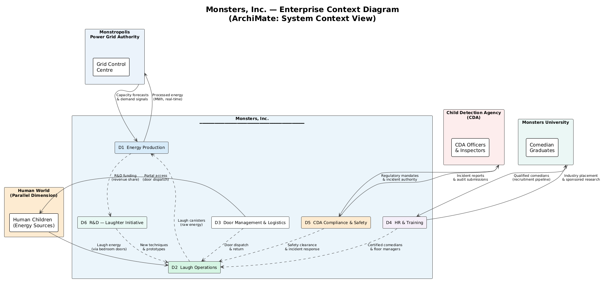
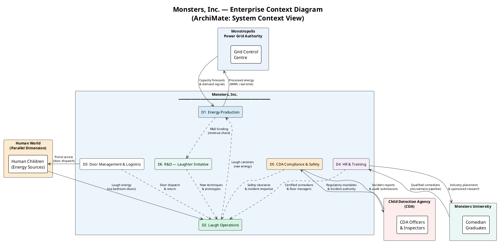
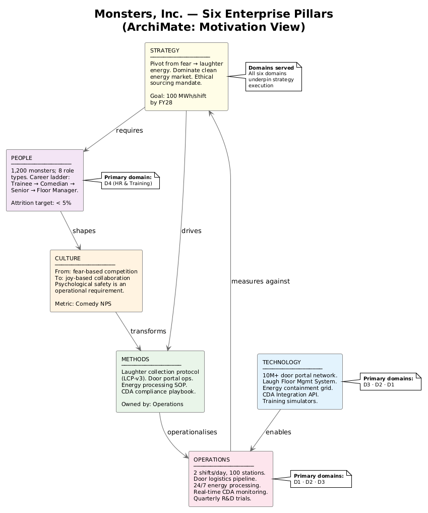
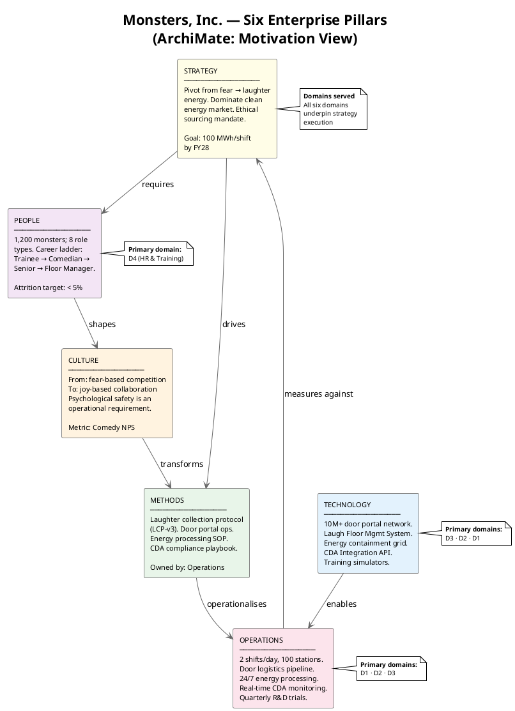
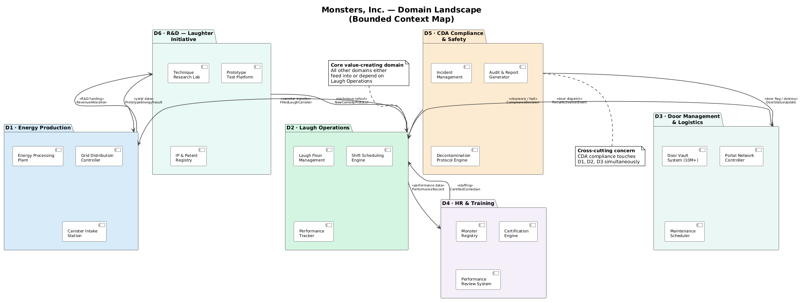
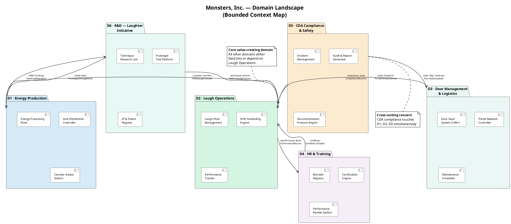
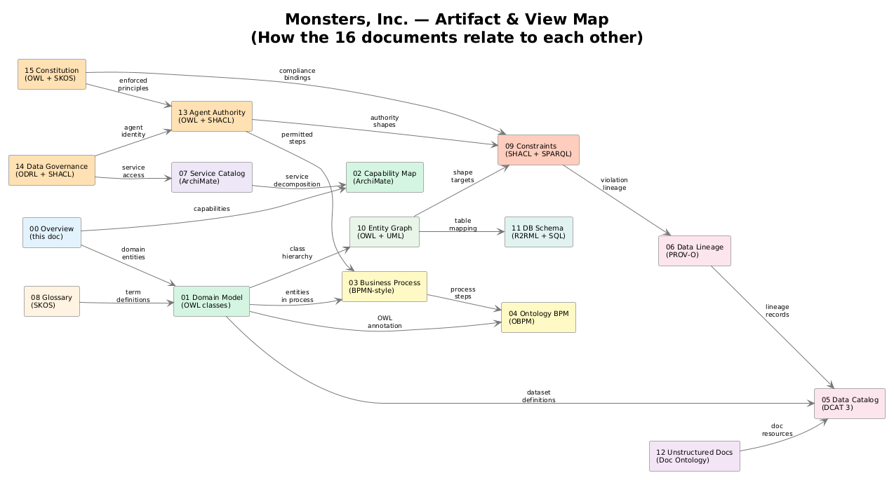
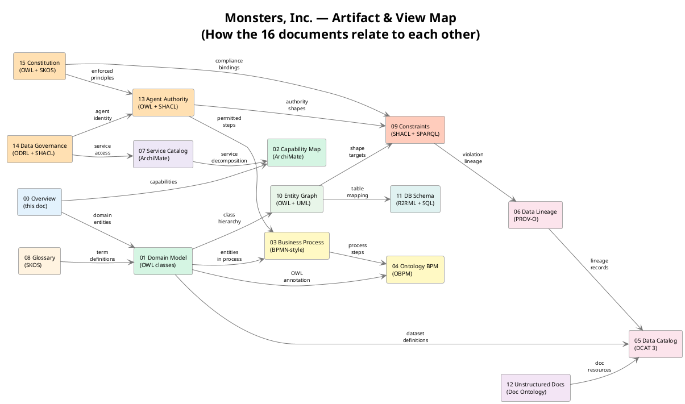
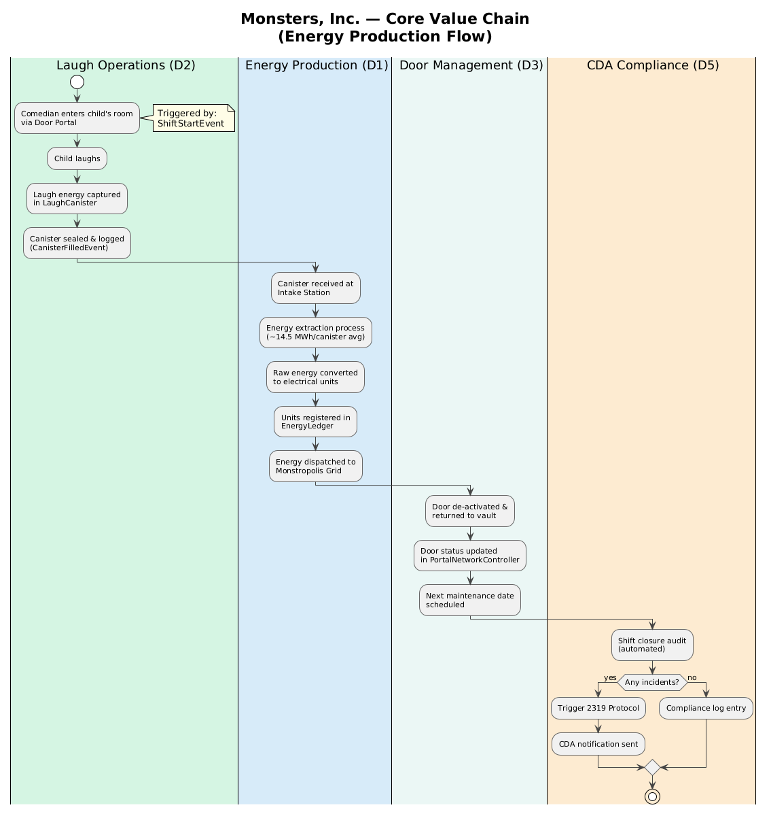
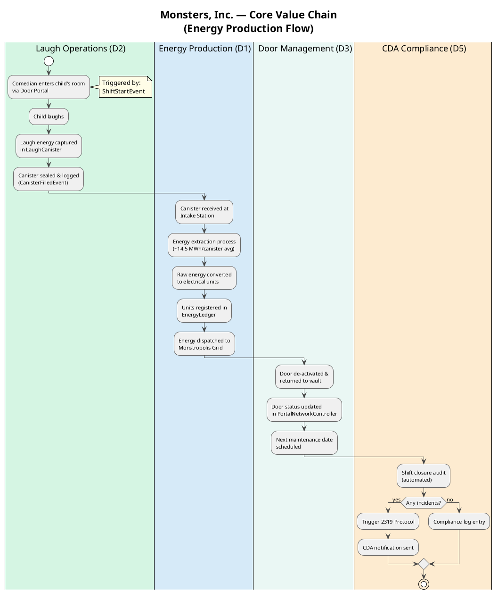

# Monsters, Inc. — Enterprise Overview

> **View:** High-Level Architecture | **Standard:** ArchiMate 3 (PlantUML approximation) | **Audience:** All stakeholders

This document provides the entry point to the Monsters, Inc. enterprise architecture. It establishes the company in its operating context, maps the six enterprise pillars, and introduces the six domains that all subsequent views elaborate.

**Navigation:** [Spec](../.claude/prompts/spec.md) | [Domain Model →](01-domain-model.md) | [Capability Map →](02-capability-map.md) | [All Views →](../README.md)

---

## 1. Enterprise Context

Monsters, Inc. operates at the intersection of two worlds — Monstropolis and the Human World — mediated by a proprietary portal network of 10+ million child bedroom doors. Energy is the product; laughter is now the source.

<!-- diagram-image -->




---

## 2. Six Enterprise Pillars

The Open Group's six enterprise strategy pillars map cleanly to Monsters, Inc.'s current operating reality. The company's transformation from fear-based to laughter-based energy is visible in every pillar.

<!-- diagram-image -->




---

## 3. Domain Landscape

The six domains and their primary inter-domain data and process flows. This is the **bounded context map** — the starting point for all subsequent domain and capability modeling.

<!-- diagram-image -->




---

## 4. Modeling Views Map

This project produces sixteen interconnected modeling views. The table below shows which standard each view uses and which domain(s) it covers.

<!-- diagram-image -->




---

## 5. Energy Production Snapshot

A quick illustration of the core value chain — from child laughter through to Monstropolis city power.

<!-- diagram-image -->




---

## 6. What's Next

| Document | What it adds |
|----------|-------------|
| [01 — Domain Model](01-domain-model.md) | Full OWL class hierarchy; domain ontology in Turtle |
| [02 — Capability Map](02-capability-map.md) | ArchiMate capability heat-map; strategic alignment |
| [03 — Business Process](03-business-process.md) | Complete Daily Laugh Run process (BPMN-style) |
| [04 — Ontology BPM](04-ontology-bpm.md) | Same process annotated with OWL — the OBPM view |
| [05 — Data Catalog](05-data-catalog.md) | DCAT 3 catalog of all 12 Monsters, Inc. data assets |
| [06 — Data Lineage](06-data-lineage.md) | PROV-O lineage chain from laugh to Monstropolis grid |
| [07 — Service Catalog](07-service-catalog.md) | ArchiMate application & technology service map |
| [08 — Glossary](08-glossary.md) | SKOS concept scheme — 40+ defined terms |
| [09 — Constraints & Queries](09-constraints-queries.md) | SHACL shapes + SPARQL business queries |
| [10 — Entity Graph](10-entity-graph.md) | Full OWL entity-relationship + RDF graph view |
| [11 — DB Schema](11-db-schema.md) | SQL schema + R2RML relational→RDF mapping |
| [12 — Unstructured Docs](12-unstructured-docs.md) | CDA forms & incident reports as typed RDF resources |
| [13 — Agent Authority & Orchestration](13-agent-model.md) | Which actions an autonomous agent may take, how authority resolves, and when it must escalate to a human |
| [14 — Data Governance, Identity & Access](14-data-governance.md) | Who may reach which systems and data, under which W3C ODRL policies — the layer the agent consults before any read |
| [15 — Constitution & Defensibility](15-constitution.md) | Company principles & regulatory requirements linked to the exact SHACL/SPARQL that enforces them |

---

## Schema Anchor

Every view in this overview ultimately resolves against one shared OWL schema — the core ontology whose header is reproduced below. Its single URI base (`https://vocab.monstersinc.com/ontology#`) is what lets sixteen otherwise-independent documents reference the same `mi:` terms without drift.

<!-- excerpt-from: ontologies/mi-core.ttl -->
```turtle
@prefix mi:    <https://vocab.monstersinc.com/ontology#> .
<https://vocab.monstersinc.com/ontology>
    a owl:Ontology ;
    rdfs:label "Monsters, Inc. Core Ontology" ;
```

---

## Why this matters

A single navigable overview is what turns sixteen separate standards artifacts into one coherent, traversable model rather than a pile of disconnected files. The Views Map makes the dependencies between views explicit, so a reader — or an autonomous agent — can follow any concept from its glossary definition through its OWL class, its process, its data catalog entry, and the SHACL shapes that govern it. Without this entry point, the cross-references that make the model defensible would be invisible, and consumers like MS IQ would have no starting node from which to walk the graph. The overview is, in effect, the table of contents that proves the architecture is integrated rather than merely co-located.
