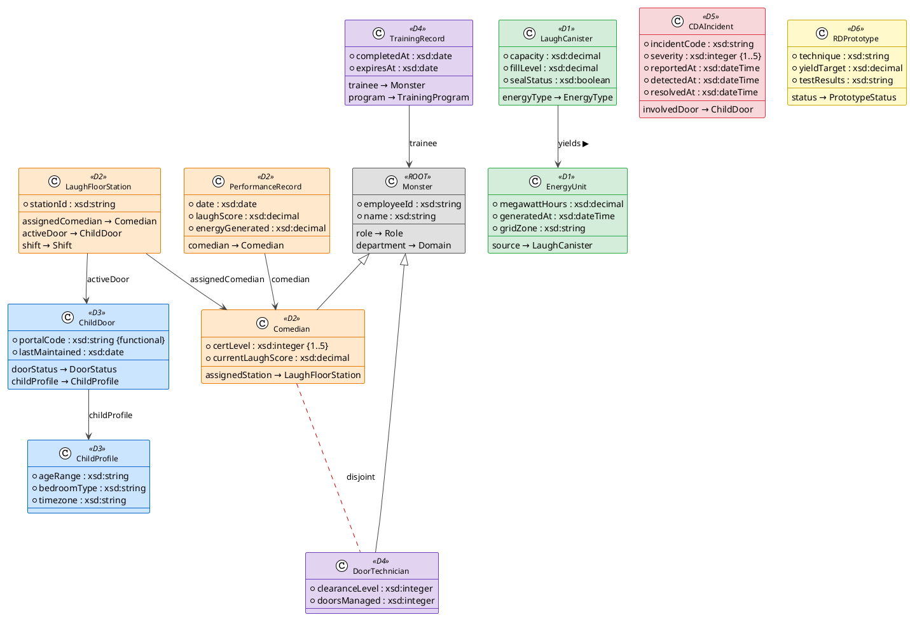
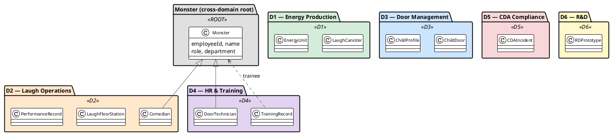

# 01 — Domain Model

| View | Standard | Audience |
|------|----------|----------|
| Logical / Ontology | OWL 2 DL | Enterprise Architects, Ontology Engineers |

[← 00 Overview](00-overview.md) | [→ 02 Capability Map](02-capability-map.md) | [All Views →](../README.md)

> **Run it:** `make ontology` — expected output: rich table showing 12 classes, properties count, and axiom count

---

## OWL Class Hierarchy



---

## Domain Partitioning



---

## Class and Property Inventory

| # | Class | Domain | Key Datatype Properties | Key Object Properties |
|---|-------|--------|------------------------|----------------------|
| 1 | `mi:Monster` | Cross-domain root | `employeeId`, `name` | `role`, `department` |
| 2 | `mi:Comedian` | D2 Laugh Operations | `certLevel` (1–5), `currentLaughScore` | `assignedStation` |
| 3 | `mi:DoorTechnician` | D4 HR & Training | `clearanceLevel`, `doorsManaged` | — |
| 4 | `mi:ChildDoor` | D3 Door Management | `portalCode` (functional), `lastMaintained` | `doorStatus`, `childProfile` |
| 5 | `mi:ChildProfile` | D3 Door Management | `ageRange`, `bedroomType`, `timezone` | — |
| 6 | `mi:LaughCanister` | D1 Energy Production | `capacity`, `fillLevel`, `sealStatus` | `energyType` |
| 7 | `mi:EnergyUnit` | D1 Energy Production | `megawattHours`, `generatedAt`, `gridZone` | `source` |
| 8 | `mi:LaughFloorStation` | D2 Laugh Operations | `stationId` | `assignedComedian`, `activeDoor`, `shift` |
| 9 | `mi:CDAIncident` | D5 CDA Compliance | `incidentCode`, `severity`, `reportedAt`, `detectedAt`, `resolvedAt` | `involvedDoor` |
| 10 | `mi:TrainingRecord` | D4 HR & Training | `completedAt`, `expiresAt` | `trainee`, `program` |
| 11 | `mi:PerformanceRecord` | D2 Laugh Operations | `date`, `laughScore`, `energyGenerated` | `comedian` |
| 12 | `mi:RDPrototype` | D6 R&D | `technique`, `yieldTarget`, `testResults` | `status` |

## Key OWL Restrictions

| Restriction | Class | Constraint | Enforcement |
|-------------|-------|-----------|-------------|
| `owl:someValuesFrom xsd:integer` on `mi:certLevel` | `mi:Comedian` | Every Comedian must have a certification level | OWL; runtime cardinality via SHACL (doc 09) |
| `owl:disjointWith` | `mi:Comedian` / `mi:DoorTechnician` | A monster cannot be both a Comedian and a DoorTechnician | OWL DL reasoner |
| `owl:disjointWith` | `mi:LaughCanister` / `mi:ScreamCanister` | A canister is either current (laugh) or legacy (scream), never both | OWL DL reasoner |

Runtime value constraints — a door's operational status, a canister's seal-before-transport rule — are intentionally expressed as **SHACL shapes** (doc 09), not OWL `owl:hasValue` restrictions. They are operational data-quality rules, not logical class definitions, so SHACL (closed-world validation) is the correct standard for them. The ontology also defines an abstract `mi:Canister` superclass over the current `mi:LaughCanister` and the legacy `mi:ScreamCanister`, modelling the scare→laughter transition (queryable via Q18).

---

## Ontology Source: `ontologies/mi-core.ttl`

The full OWL 2 schema — 12 classes, 35 properties, enumerations, and restrictions — is maintained in the source file. A representative excerpt (the disjoint `Comedian`/`DoorTechnician` axiom and the `certLevel` restriction) appears below.

<!-- excerpt-from: ontologies/mi-core.ttl -->
```turtle
mi:Comedian a owl:Class ;
    rdfs:subClassOf mi:Monster ;
    rdfs:subClassOf [
        a owl:Restriction ;
        owl:onProperty mi:certLevel ;
        owl:someValuesFrom xsd:integer
    ] ;
    rdfs:label "Comedian" ;
    rdfs:comment "A monster certified to perform comedy routines on the Laugh Floor to capture child laughter energy." .

mi:Comedian owl:disjointWith mi:DoorTechnician .
```

> **Full artifact:** [ontologies/mi-core.ttl](../ontologies/mi-core.ttl) — generated/maintained as the single source of truth.

---

## Why this matters

The OWL 2 DL ontology is the single authoritative schema that every downstream artifact — SHACL shapes, SPARQL queries, R2RML mappings, and process annotations — imports and extends. Without a formally consistent class hierarchy and disjointness axioms, cross-domain reasoning (e.g. detecting a Comedian acting as a DoorTechnician) would require ad hoc application logic instead of a standard OWL reasoner. The `mi:` namespace establishes a stable, dereferenceable IRI space that MS IQ can ingest directly for automated capability and gap analysis.

---

## Cross-references

| Related doc | Relationship |
|-------------|-------------|
| [08 — Glossary (SKOS)](08-glossary.md) | Controlled vocabulary for all `rdfs:label` terms used in this ontology |
| [09 — SHACL Shapes](09-constraints-queries.md) | Closes the open-world assumption: enforces `mi:certLevel` and `mi:sealStatus` constraints |
| [10 — Entity Graph](10-entity-graph.md) | Full instance-level graph populated from `data/seed_graph.ttl` |
| [04 — OBPM Annotations](04-ontology-bpm.md) | BPMN-O annotations reference `mi:Comedian` and `mi:LaughFloorStation` as process participants |
| [11 — R2RML Mappings](11-db-schema.md) | Maps SQL tables (COMEDIAN, CHILD_DOOR, PERFORMANCE_RECORD) to classes defined here |
