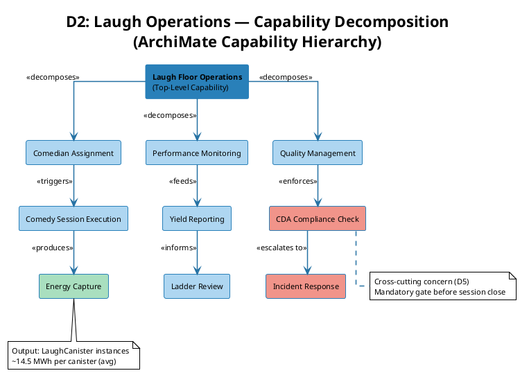

# Capability Map — ArchiMate Capability View

> **View:** Capability | **Standard:** ArchiMate 3 | **Audience:** Strategy & Architecture

This view maps all twelve operational capabilities of Monsters, Inc. across six bounded domains, revealing current maturity levels and strategic importance to support investment prioritisation and transformation planning.

**Navigation:** [← 01 Domain Model](01-domain-model.md) | [→ 03 Business Process](03-business-process.md) | [All Views →](../README.md)

---

## 1. Capability Heat-Map

Each capability is colour-coded by maturity level (1 = nascent, 5 = optimised). Grouping by domain surfaces where the enterprise is over- or under-invested relative to strategic need.

```plantuml
@startuml MI-Capability-Heatmap
!theme plain
skinparam backgroundColor #FFFFFF
skinparam componentStyle rectangle
skinparam defaultFontName Helvetica
skinparam defaultFontSize 11
skinparam packageBorderColor #555555
skinparam packageBackgroundColor #F8F8F8
skinparam componentBorderColor #555555
skinparam arrowColor #444444

title Monsters, Inc. — Capability Heat-Map\n(ArchiMate Capability View · Colour = Maturity Level)

package "D1: Energy Production" #EAF2FB {
  [Energy Processing\nMaturity: 4 ★★★★\nStrategic: Critical] #a8d5a2
  [Energy Grid Integration\nMaturity: 4 ★★★★\nStrategic: Critical] #a8d5a2
}

package "D2: Laugh Operations" #EBF5FB {
  [Laugh Energy Capture\nMaturity: 5 ★★★★★\nStrategic: Critical] #lightgreen
  [Performance Analytics\nMaturity: 2 ★★\nStrategic: Growing] #ffb366
}

package "D3: Door Management & Logistics" #FEF9E7 {
  [Door Portal Operations\nMaturity: 4 ★★★★\nStrategic: Critical] #a8d5a2
  [Door Maintenance\nMaturity: 3 ★★★\nStrategic: Supporting] #ffe680
}

package "D4: HR & Training" #EAF7F4 {
  [Comedian Recruitment\nMaturity: 3 ★★★\nStrategic: High] #ffe680
  [Comedian Training & Cert\nMaturity: 4 ★★★★\nStrategic: High] #a8d5a2
}

package "D5: CDA Compliance & Safety" #FDEDEC {
  [CDA Compliance\nMaturity: 3 ★★★\nStrategic: High] #ffe680
  [Regulatory Reporting\nMaturity: 3 ★★★\nStrategic: Mandatory] #ffe680
}

package "D6: R&D — Laughter Initiative" #F4ECF7 {
  [Laugh Yield Optimisation\nMaturity: 2 ★★\nStrategic: Growing] #ffb366
  [Laughter Technique R&D\nMaturity: 2 ★★\nStrategic: Strategic] #ffb366
}

legend right
  |= Colour |= Maturity Level |
  | <#lightgreen>     | 5 — Optimised / Critical |
  | <#a8d5a2>     | 4 — Managed |
  | <#ffe680>     | 3 — Defined |
  | <#ffb366>     | 2 — Developing |
  | <#ff8080>     | 1 — Initial |
endlegend

@enduml
```



---

## 2. D2 Laugh Operations — Capability Decomposition (ArchiMate)

D2 is the core value-creating domain. This diagram decomposes the top-level "Laugh Floor Operations" capability into three functional branches: assignment and execution, performance monitoring, and quality assurance. All other domains either feed into or regulate this hierarchy.



---

## 3. Capability Maturity Summary

| Capability | Domain | Maturity | Strategic Importance | Realised By |
|---|---|:---:|---|---|
| Laugh Energy Capture | D2 | 5 | Critical | LFMS (Laugh Floor Mgmt System) |
| Door Portal Operations | D3 | 4 | Critical | DPCS (Door Portal Control System) |
| Energy Processing | D1 | 4 | Critical | ELS (Energy Ledger Service) |
| Energy Grid Integration | D1 | 4 | Critical | ELS (Energy Ledger Service) |
| Comedian Training & Cert | D4 | 4 | High | HRCP (HR & Certification Platform) |
| CDA Compliance | D5 | 3 | High | CDACG (CDA Compliance Gateway) |
| Comedian Recruitment | D4 | 3 | High | HRCP (HR & Certification Platform) |
| Door Maintenance | D3 | 3 | Supporting | DPCS (Door Portal Control System) |
| Regulatory Reporting | D5 | 3 | Mandatory | CDACG (CDA Compliance Gateway) |
| Laugh Yield Optimisation | D6 | 2 | Growing | RDLMS (R&D Lab Management System) |
| Performance Analytics | D2, D4 | 2 | Growing | LFMS + HRCP (integrated) |
| Laughter Technique R&D | D6 | 2 | Strategic | RDLMS (R&D Lab Management System) |

**Maturity scale:** 1 = Initial · 2 = Developing · 3 = Defined · 4 = Managed · 5 = Optimised

> These twelve capabilities are now queryable individuals (`mi:Capability`) in `ontologies/mi-motivation.ttl`, linked to the processes that realise them via `mi:realizesCapability` — see query Q16.

The top capability, *Laugh Energy Capture*, appears in the source as a `mi:Capability` individual carrying its maturity score, owning domain, and the strategic goal it serves:

<!-- excerpt-from: ontologies/mi-motivation.ttl -->
```turtle
mi:Cap_LaughEnergyCapture a mi:Capability ; rdfs:label "Laugh Energy Capture" ;
    mi:capabilityMaturity 5 ; mi:ownedByDomain mi:LaughOperations ;
    mi:servesGoal mi:Goal_CleanEnergy .
```

---

## 4. Maturity Gap Analysis

The heat-map surfaces three planning signals:

- **Fully optimised (Level 5):** Only Laugh Energy Capture has reached optimised status — reflecting two years of post-transition investment since the laughter pivot. This is the enterprise's primary revenue mechanism and should be treated as a benchmark for other D2 capabilities.
- **Critical gap — D6 at Level 2:** Both R&D capabilities score 2 while carrying Growing and Strategic importance ratings. As Laugh Energy Capture approaches theoretical yield ceilings, D6 investment is the next strategic lever. This is the strongest investment signal in the map.
- **Compliance risk — D5 at Level 3:** CDA Compliance and Regulatory Reporting are both Defined but not yet Managed. Given that CDA regulates D1, D2, and D3 simultaneously, a compliance failure is a multi-domain risk event. Raising both to Level 4 before expanding floor operations is advisable.

---

## 5. Why This Matters

A capability heat-map is the correct first strategic planning artifact because it decouples *what the enterprise must be able to do* from *how it currently does it* — making investment priorities visible without prescribing solution architecture. For Monsters, Inc., it immediately surfaces the asymmetry between the highly-optimised core (Laugh Energy Capture) and the underdeveloped enabling capabilities (D6 R&D, Performance Analytics) that will determine whether current yield levels can be sustained and grown. Architects and strategy teams use this view to sequence transformation initiatives, negotiate budget allocation across domain owners, and identify where capability gaps create regulatory or operational exposure.

---

## Cross-References

- [00 Overview](00-overview.md) — company context and domain landscape from which these capabilities derive
- [07 Service Catalog](07-service-catalog.md) — the application and technology services that realise each capability (LFMS, DPCS, ELS, etc.)
- [04 Ontology BPM](04-ontology-bpm.md) — the business processes that exercise these capabilities at runtime
- [09 Constraints & Queries](09-constraints-queries.md) — SHACL shapes and SPARQL queries that enforce capability quality gates (CDA compliance check, certification validation)
