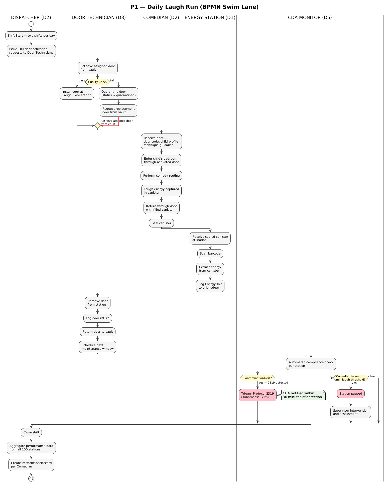
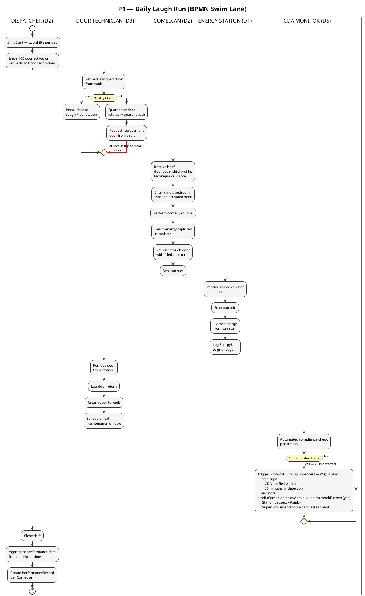
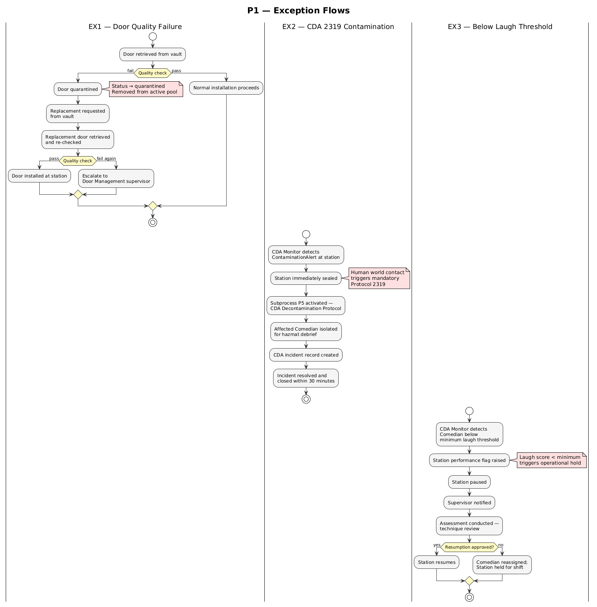
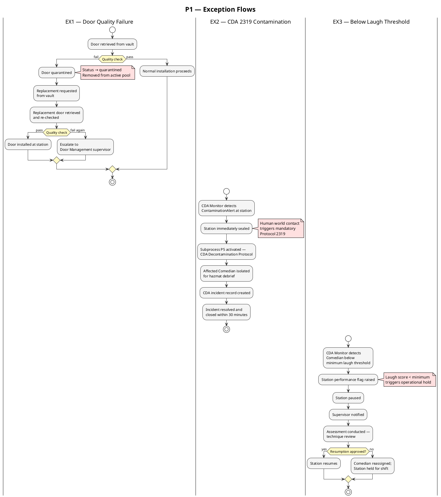

# Business Process — P1: Daily Laugh Run

> **View:** Process | **Standard:** BPMN (via UML Activity) | **Audience:** Operations, Process Architects

P1: Daily Laugh Run is the core value-creating process at Monsters, Inc., spanning five organisational domains and two shifts per day across 100 comedy stations. It transforms child laughter into sealed laugh canisters (~14.5 MWh each), which are extracted into grid-ready energy units by day's end.

**Navigation:** [← 02 Capability Map](02-capability-map.md) | [→ 04 Ontology BPM](04-ontology-bpm.md) | [All Views →](../README.md)

---

## Diagram 1: P1 — Daily Laugh Run (Swim Lane)

<!-- diagram-image -->




---

## Diagram 2: Exception Flows

<!-- diagram-image -->




---

## Process Steps

| Step | Actor | Domain | Creates / Modifies |
|------|-------|--------|--------------------|
| S1 — Issue door activation requests | Dispatcher | D2 Laugh Operations | 100 activation requests issued |
| S2 — Retrieve door from vault | Door Technician | D3 Door Management | ChildDoor retrieved; quality check performed |
| S3 — Install door at station | Door Technician | D3 Door Management | ChildDoor status → active at LaughFloorStation |
| S4 — Receive brief and perform routine | Comedian | D2 Laugh Operations | Laugh energy captured in LaughCanister |
| S5 — Seal canister | Comedian | D2 Laugh Operations | LaughCanister sealStatus → true |
| S6 — Extract energy and log EnergyUnit | Energy Station | D1 Energy Production | EnergyUnit created; grid ledger updated |
| S7 — Remove door and return to vault | Door Technician | D3 Door Management | ChildDoor status → maintenance; vault record updated |
| S8 — Automated compliance check | CDA Monitor | D5 CDA Compliance | CDAIncident created (if triggered); station flagged |
| S9 — Close shift and aggregate data | Dispatcher | D2 Laugh Operations | PerformanceRecord created per Comedian |

---

## Semantic Definition

P1 is not only a diagram: it is a `mi:BusinessProcess` individual in `ontologies/mi-process.ttl`, carrying its trigger event and the artefacts it produces and consumes, so the process can be reasoned over by SPARQL and the agent authority model in Doc 13.

<!-- excerpt-from: ontologies/mi-process.ttl -->
```turtle
mi:P1_DailyLaughRun a mi:BusinessProcess ;
    rdfs:label       "P1 — Daily Laugh Run" ;
    mi:triggeredBy   mi:ShiftStartEvent ;
    mi:produces      mi:PerformanceRecord, mi:EnergyUnit ;
    mi:consumesInput mi:ChildDoor, mi:LaughCanister ;
```

---

## Why This Matters

Modeling P1 with swim lanes makes the five-domain coordination explicit: Laugh Operations, Door Management, Energy Production, and CDA Compliance must hand off control at precise points in every shift, and a failure at any hand-off (a quarantined door, a sub-threshold Comedian, a contamination alert) propagates side-effects across domain boundaries. Without this process view, the cross-domain dependencies remain tacit and unmeasurable. Exposing them in a shared notation — BPMN-style activity lanes — gives architects, operations managers, and compliance officers a common language for designing controls, SLAs, and exception-handling procedures around the same artefact.

---

## Cross-References

- [04 Ontology BPM](04-ontology-bpm.md) — this process annotated with OWL semantics, linking each step to its domain class and property chain
- [09 Constraints & Queries](09-constraints-queries.md) — SHACL shapes enforce pre-conditions for dispatch (certified Comedian, active ChildDoor, maintenance date in range)
- [06 Data Lineage](06-data-lineage.md) — PROV-O traces the laugh → canister → EnergyUnit → grid lineage chain originating in P1
