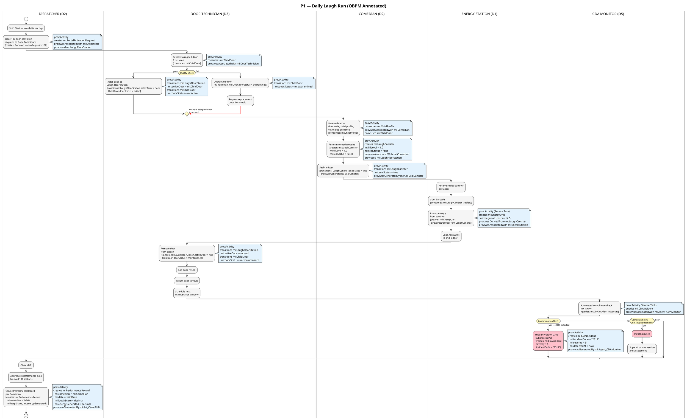
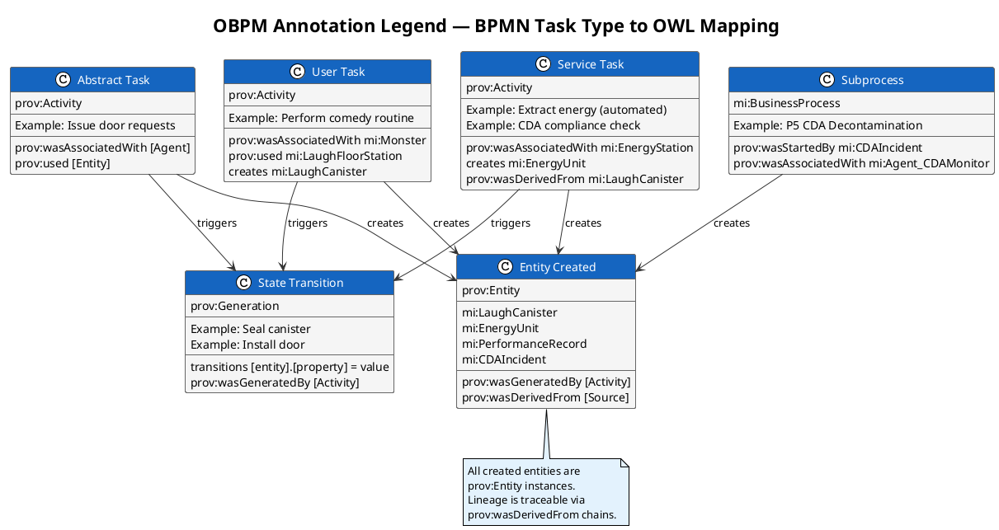

# Ontology-Annotated Business Process — OBPM View

> **View:** OBPM (Ontology-Annotated BPM) | **Standard:** OWL 2 + BPMN-O + PROV-O | **Audience:** Enterprise Architects, Knowledge Engineers

OBPM (Ontology-Annotated Business Process Modelling) extends a standard BPMN process by binding each activity to the OWL class instances it creates, consumes, or transitions — producing a process model that is simultaneously executable by operations and queryable by a knowledge graph. This approach bridges the gap between workflow notation and semantic data modelling, enabling formal reasoning over process state at every step of the Daily Laugh Run.

**Navigation:** [← 03 Business Process](03-business-process.md) | [→ 05 Data Catalog](05-data-catalog.md) | [All Views →](../README.md)

---

## Diagram 1: P1 — Daily Laugh Run with OBPM Annotations



---

## Diagram 2: OBPM Annotation Legend — BPMN Task Types to OWL/PROV-O



---

## OBPM Annotation Table

| Step | Activity | BPMN Type | Creates | Consumes | OWL State Change | PROV-O Relationship |
|------|----------|-----------|---------|----------|-----------------|---------------------|
| S1 | Issue door activation requests | Abstract Task | `mi:PortalActivationRequest` ×100 | — | — | `prov:wasAssociatedWith mi:Dispatcher` |
| S2 | Retrieve door from vault | User Task | — | `mi:ChildDoor` | — | `prov:wasAssociatedWith mi:DoorTechnician`; `prov:used mi:ChildDoor` |
| S3 | Install door at station | User Task | — | `mi:ChildDoor` | `mi:LaughFloorStation mi:activeDoor = door`; `mi:ChildDoor mi:doorStatus = mi:active` | `prov:wasAssociatedWith mi:DoorTechnician` |
| S4 | Perform comedy routine | User Task | `mi:LaughCanister` (`mi:fillLevel = 1.0`, `mi:sealStatus = false`) | `mi:ChildProfile` | — | `prov:wasAssociatedWith mi:Comedian`; `prov:used mi:LaughFloorStation` |
| S5 | Seal canister | User Task | — | `mi:LaughCanister` | `mi:LaughCanister mi:sealStatus = true` | `prov:wasGeneratedBy mi:Act_SealCanister` |
| S6 | Extract energy from canister | Service Task | `mi:EnergyUnit` (`mi:megawattHours = 14.5`) | `mi:LaughCanister` (sealed) | — | `prov:wasDerivedFrom mi:LaughCanister`; `prov:wasAssociatedWith mi:EnergyStation` |
| S7 | Remove door and return to vault | User Task | — | `mi:ChildDoor` | `mi:ChildDoor mi:doorStatus = mi:maintenance`; `mi:LaughFloorStation mi:activeDoor` removed | `prov:wasAssociatedWith mi:DoorTechnician` |
| S8 | Automated compliance check | Service Task | `mi:CDAIncident` (if triggered) | — | `mi:CDAIncident mi:detectedAt`, `mi:severity`, `mi:incidentCode` set on trigger | `prov:wasGeneratedBy mi:Agent_CDAMonitor`; `prov:wasAssociatedWith mi:Agent_CDAMonitor` |
| S9 | Close shift / create PerformanceRecord | Abstract Task | `mi:PerformanceRecord` (`mi:comedian`, `mi:date`, `mi:laughScore`, `mi:energyGenerated`) | — | — | `prov:wasGeneratedBy mi:Act_CloseShift`; `prov:wasAssociatedWith mi:Dispatcher` |

---

## Inline Turtle Snippet — Three P1 Activities Fully Annotated

```turtle
@prefix mi:    <https://vocab.monstersinc.com/ontology#> .
@prefix bpmno: <http://dkm.fbk.eu/index.php/BPMN2_Ontology#> .
@prefix prov:  <http://www.w3.org/ns/prov#> .
@prefix rdfs:  <http://www.w3.org/2000/01/rdf-schema#> .
@prefix xsd:   <http://www.w3.org/2001/XMLSchema#> .

# ── Activity: Capture Laugh Energy (Perform Comedy Routine) ──────────────────

mi:Act_CaptureLaughEnergy a bpmno:Task, prov:Activity ;
    rdfs:label "Capture Laugh Energy" ;
    prov:wasAssociatedWith mi:Comedian_Sulley ;
    prov:used mi:LaughFloorStation_042 .

# Entity: LaughCanister created by this activity
mi:CAN_20240315_042 a mi:LaughCanister ;
    mi:fillLevel "1.0"^^xsd:decimal ;
    mi:sealStatus "false"^^xsd:boolean ;
    mi:capacity "14.5"^^xsd:decimal ;
    mi:energyType mi:laughEnergy ;
    prov:wasGeneratedBy mi:Act_CaptureLaughEnergy .

# ── Activity: Seal Canister ──────────────────────────────────────────────────

mi:Act_SealCanister a bpmno:Task, prov:Activity ;
    rdfs:label "Seal Canister" ;
    prov:wasAssociatedWith mi:Comedian_Sulley ;
    prov:used mi:CAN_20240315_042 .

# State transition: LaughCanister sealed
# (updated sealStatus — the same resource after the activity completes)
mi:CAN_20240315_042 mi:sealStatus "true"^^xsd:boolean ;
    prov:wasGeneratedBy mi:Act_SealCanister .

# ── Activity: Extract Energy from Canister ───────────────────────────────────

mi:Act_ExtractEnergy a bpmno:Task, prov:Activity ;
    rdfs:label "Extract Energy from Canister" ;
    prov:used mi:CAN_20240315_042 ;
    prov:wasAssociatedWith mi:Agent_EnergyProcessingPlant .

# Entity: EnergyUnit produced from the sealed canister
mi:EU_20240315_042_001 a mi:EnergyUnit ;
    mi:megawattHours "14.5"^^xsd:decimal ;
    mi:generatedAt "2024-03-15T14:30:00Z"^^xsd:dateTime ;
    mi:gridZone "MONSTROPOLIS-ZONE-A" ;
    mi:source mi:CAN_20240315_042 ;
    prov:wasDerivedFrom mi:CAN_20240315_042 ;
    prov:wasGeneratedBy mi:Act_ExtractEnergy .

# ── Activity: Close Shift — Create PerformanceRecord ────────────────────────

mi:Act_CloseShift a bpmno:Task, prov:Activity ;
    rdfs:label "Close Shift and Aggregate Performance Data" ;
    prov:wasAssociatedWith mi:Agent_Dispatcher .

# Entity: PerformanceRecord created for Sulley's shift
mi:PR_20240315_Sulley a mi:PerformanceRecord ;
    mi:comedian mi:Comedian_Sulley ;
    mi:date "2024-03-15"^^xsd:date ;
    mi:laughScore "9.8"^^xsd:decimal ;
    mi:energyGenerated "14.5"^^xsd:decimal ;
    prov:wasGeneratedBy mi:Act_CloseShift .
```

---

## Why This Matters

OBPM closes the gap between "a process step ran" and "what semantic entity changed state as a result" — every activity in P1 now has a machine-readable contract expressed in OWL + PROV-O, not just a box in a swim lane. This makes process audit trails queryable by a SPARQL engine: you can ask which `mi:EnergyUnit` was derived from which `mi:LaughCanister`, which `mi:Comedian` performed the routine that generated it, and whether the corresponding `mi:PerformanceRecord` was created before shift close. By grounding BPMN tasks in `prov:Activity` and entities in `prov:Entity`, the Daily Laugh Run becomes a first-class node in the enterprise knowledge graph rather than a diagram that sits outside it.

---

## Cross-References

- [03 Business Process](03-business-process.md) — the base P1 swim lane this document annotates with OWL semantics
- [01 Domain Model](01-domain-model.md) — the OWL classes (`mi:LaughCanister`, `mi:EnergyUnit`, `mi:PerformanceRecord`, etc.) used as OBPM annotations
- [06 Data Lineage](06-data-lineage.md) — PROV-O relationships established in P1 continue through the full laugh → canister → energy → grid lineage chain
