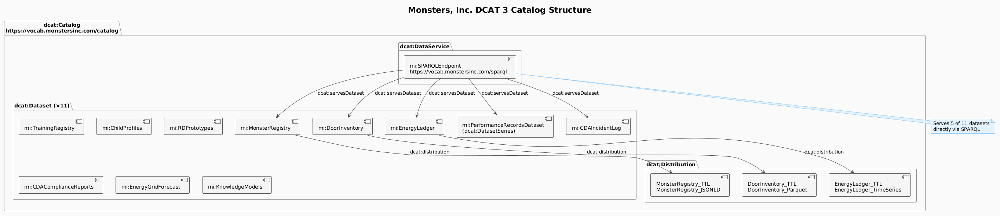
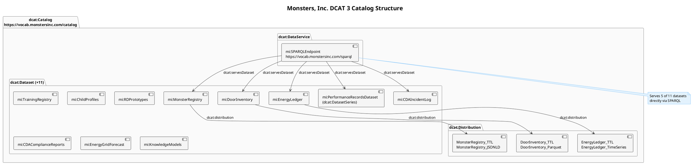
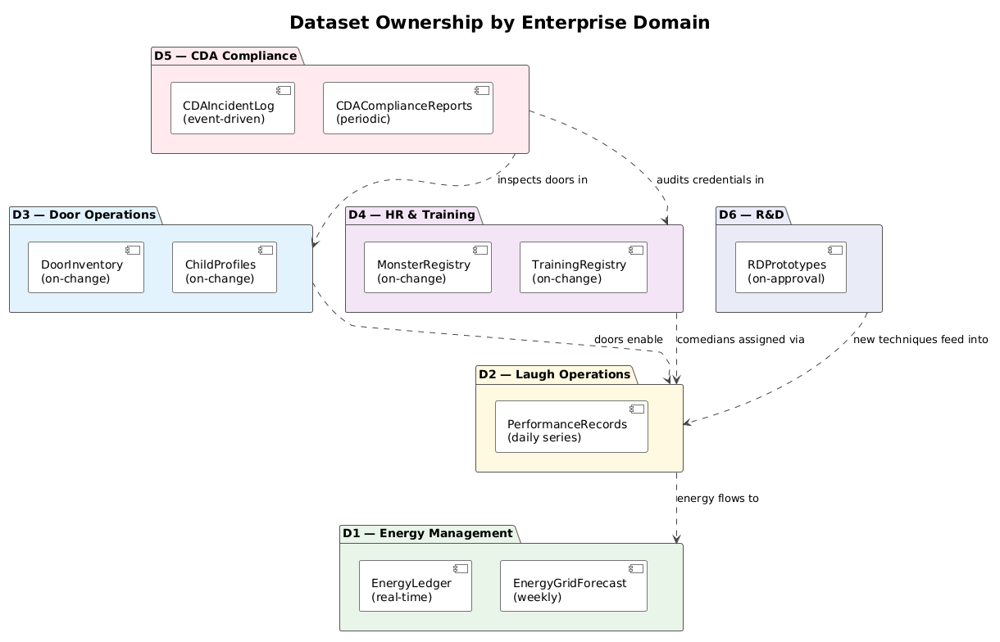
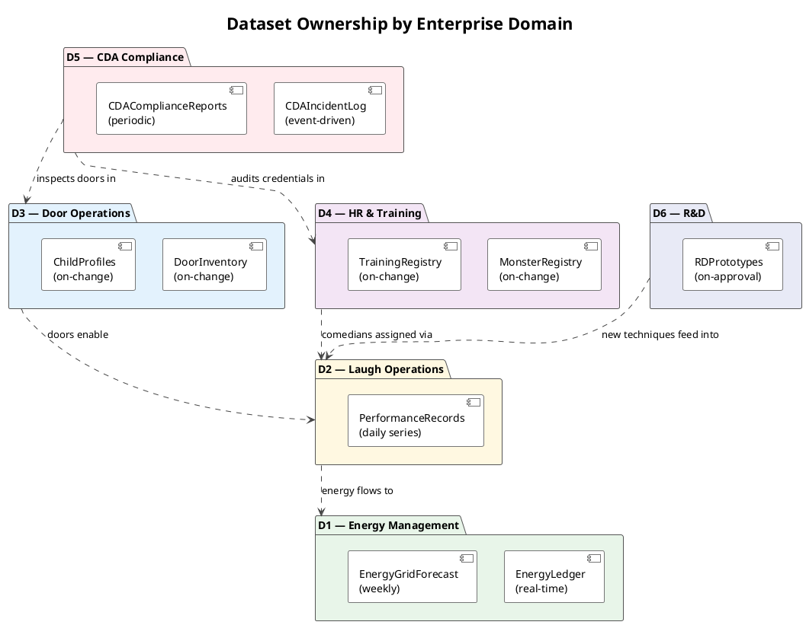

# Data Catalog — DCAT 3

> **View:** Data Catalog | **Standard:** DCAT 3 (W3C) | **Audience:** Data Stewards, Architects, Consumers

The Monsters, Inc. Enterprise Data Catalog formally describes all 11 operational, compliance, and R&D datasets using the W3C DCAT 3 standard, enabling machine-readable discovery, licensing, and access negotiation. Each dataset is assigned to one of the six enterprise domains and published via a central SPARQL endpoint, giving downstream consumers — including the MS IQ platform — a single authoritative registry to query.

> **Run it:** `make catalog` — builds a DCAT catalog from the on-disk data assets (→ `build/mi-catalog.generated.ttl`), printing a live inventory and cross-checking it against the 11 datasets in the authored `mi-catalog.ttl`

**Navigation:** [← 04 Ontology BPM](04-ontology-bpm.md) | [→ 06 Data Lineage](06-data-lineage.md) | [All Views →](../README.md)

---

## Diagram 1: DCAT Catalog Structure

<!-- diagram-image -->




---

## Diagram 2: Dataset Owner Map by Domain

<!-- diagram-image -->




---

## Dataset Inventory

| Dataset | Description | Format(s) | Owner Domain | Update Frequency |
|---|---|---|---|---|
| MonsterRegistry | All monster employees — roles, credentials, certification status | Turtle, JSON-LD | D4 HR & Training | On change |
| DoorInventory | Full door inventory — status, maintenance, dimensional IDs | Turtle, Parquet | D3 Door Operations | On change |
| PerformanceRecordsDataset | Daily slices — laugh yield, door assignments, shift scores | (DatasetSeries) | D2 Laugh Operations | Daily |
| EnergyLedger | Real-time laugh energy harvest per performance event | Turtle, JSON TimeSeries | D1 Energy | Real-time / continuous |
| CDAIncidentLog | CDA compliance incidents — containment, severity, resolution | (via SPARQL) | D5 CDA Compliance | Event-driven |
| TrainingRegistry | Comedian training programmes, certs, competency assessments | (via SPARQL) | D4 HR & Training | On change |
| ChildProfiles | Anonymised child profiles — laugh-response ratings, session history | (via SPARQL) | D3 Door Operations | On change |
| RDPrototypes | Laugh-amplification prototypes — test results, approval, yield projections | (via SPARQL) | D6 R&D | On approval |
| CDAComplianceReports | Periodic formal compliance reports submitted to CDA | (via SPARQL) | D5 CDA Compliance | Periodic |
| EnergyGridForecast | Grid demand forecasts derived from laugh yield trends | (via SPARQL) | D1 Energy | Weekly |
| KnowledgeModels | OWL/SKOS/ODRL modules an autonomous agent loads to reason within company rules: agent authority + HITL, motivation/capability, data governance + access policy, and the company constitution | Turtle | Enterprise / Governance (cross-domain) | On change |

---

## Full Catalog Turtle

The complete DCAT 3 catalog — `dcat:Catalog`, all 10 `dcat:Dataset`/`dcat:DatasetSeries` entries, their distributions, and the SPARQL `dcat:DataService` — is maintained in the source file. A representative excerpt (the catalog node and its dataset roster) appears below.

<!-- excerpt-from: ontologies/mi-catalog.ttl -->
```turtle
<https://vocab.monstersinc.com/catalog> a dcat:Catalog ;
    dct:title "Monsters, Inc. Enterprise Data Catalog"@en ;
    dct:description "DCAT 3 catalog of all Monsters, Inc. data assets, covering operational, compliance, and R&D datasets."@en ;
    dct:publisher <https://vocab.monstersinc.com/org/monsters-inc> ;
    dct:created "2024-01-01"^^xsd:date ;
    dcat:dataset
        mi:MonsterRegistry,
        mi:DoorInventory,
        mi:PerformanceRecordsDataset,
        mi:EnergyLedger,
        mi:EnergyGridForecast,
        mi:KnowledgeModels ;
    dcat:service mi:SPARQLEndpoint .
```

> **Full artifact:** [ontologies/mi-catalog.ttl](../ontologies/mi-catalog.ttl) — generated/maintained as the single source of truth.

---

## Why This Matters

A DCAT 3 catalog transforms a collection of files into a discoverable, standards-compliant data ecosystem: each dataset carries its publisher, theme, update frequency, and access URL as structured metadata, allowing tools like MS IQ to automatically discover and federate over Monsters, Inc. data without manual configuration. Modelling `PerformanceRecordsDataset` as a `dcat:DatasetSeries` rather than a flat `dcat:Dataset` accurately reflects that the asset grows as a time-partitioned collection, enabling consumers to request specific daily slices via the SPARQL endpoint. The catalog also makes the cross-cutting CDA compliance concern structurally visible: two datasets (`CDAIncidentLog`, `CDAComplianceReports`) are owned by D5 but reference entities from D3 and D4, precisely where the compliance constraints in `shapes/mi-compliance.shacl.ttl` fire.

---

## Cross-References

- [06 Data Lineage](06-data-lineage.md) — `EnergyLedger` is the primary subject of the PROV-O lineage chain tracing laugh harvest through canister fill to grid dispatch
- [11 DB Schema](11-db-schema.md) — the R2RML mapping feeds `DoorInventory` and `PerformanceRecordsDataset` by lifting CHILD_DOOR and PERFORMANCE_RECORD SQL tables to RDF
- [12 Unstructured Docs](12-unstructured-docs.md) — `CDAComplianceReports` originates as unstructured PDF documents before being ingested and annotated with the document ontology
