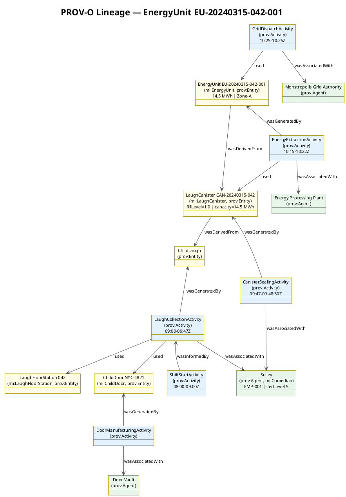
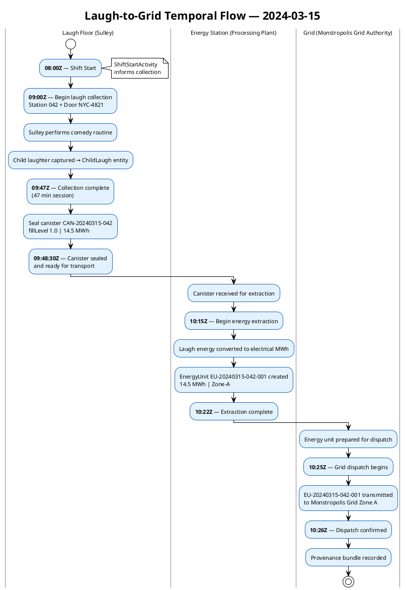

# Data Lineage — PROV-O Provenance Chain

> **View:** Lineage / Provenance | **Standard:** PROV-O (W3C) | **Audience:** Data Stewards, Compliance, Architects

This document traces the complete end-to-end data lineage for a single unit of clean energy — from the moment a child's laughter is captured at a Laugh Floor station, through canister sealing and energy extraction, to final dispatch to the Monstropolis Power Grid. By encoding this chain in PROV-O, Monsters, Inc. can audit any energy unit back to the comedian, the child door, and the exact shift that generated it.

> **Run it:** `make Q=Q8 query-one` — expected output: lineage chain showing Sulley → CAN-20240315-042 → EU-001 → Monstropolis Grid Zone A

**Navigation:** [← 05 Data Catalog](05-data-catalog.md) | [→ 07 Service Catalog](07-service-catalog.md) | [All Views →](../README.md)

---

## PROV-O Conceptual Overview

PROV-O (the W3C Provenance Ontology) models provenance using three core concepts:

| Concept | Description | Example in this chain |
|---------|-------------|----------------------|
| `prov:Entity` | A physical, digital, or conceptual thing | ChildLaugh, LaughCanister, EnergyUnit |
| `prov:Activity` | Something that occurred over a period of time | LaughCollectionActivity, CanisterSealing |
| `prov:Agent` | Something that bears responsibility for an activity | Sulley, Energy Processing Plant |

The key relationships between them are:

| Predicate | Direction | Meaning |
|-----------|-----------|---------|
| `prov:wasGeneratedBy` | Entity → Activity | This entity was produced by that activity |
| `prov:wasDerivedFrom` | Entity → Entity | This entity is derived from that entity |
| `prov:wasAssociatedWith` | Activity → Agent | This activity was performed by/under that agent |
| `prov:used` | Activity → Entity | This activity consumed or made use of that entity |
| `prov:wasInformedBy` | Activity → Activity | This activity was triggered/enabled by that activity |

---

## Diagram 1: PROV-O Lineage Graph



---

## Diagram 2: Temporal Swimlane



---

## PROV-O Relationships Table

All PROV-O triples modelled in `ontologies/mi-provenance.ttl`:

| Subject | Predicate | Object |
|---------|-----------|--------|
| `mi:ChildLaugh_20240315_042` | `prov:wasGeneratedBy` | `mi:LaughCollectionActivity` |
| `mi:LaughCollectionActivity` | `prov:wasAssociatedWith` | `mi:Agent_Sulley` |
| `mi:LaughCollectionActivity` | `prov:used` | `mi:LaughFloorStation_042` |
| `mi:LaughCollectionActivity` | `prov:used` | `mi:ChildDoor_NYC4821` |
| `mi:LaughCollectionActivity` | `prov:wasInformedBy` | `mi:ShiftStartActivity` |
| `mi:ChildDoor_NYC4821` | `prov:wasGeneratedBy` | `mi:DoorManufacturingActivity` |
| `mi:DoorManufacturingActivity` | `prov:wasAssociatedWith` | `mi:Agent_DoorVault` |
| `mi:LaughCanister_CAN20240315042` | `prov:wasDerivedFrom` | `mi:ChildLaugh_20240315_042` |
| `mi:LaughCanister_CAN20240315042` | `prov:wasGeneratedBy` | `mi:CanisterSealingActivity` |
| `mi:CanisterSealingActivity` | `prov:wasAssociatedWith` | `mi:Agent_Sulley` |
| `mi:EnergyExtractionActivity` | `prov:used` | `mi:LaughCanister_CAN20240315042` |
| `mi:EnergyExtractionActivity` | `prov:wasAssociatedWith` | `mi:Agent_EnergyProcessingPlant` |
| `mi:EnergyUnit_EU20240315042001` | `prov:wasDerivedFrom` | `mi:LaughCanister_CAN20240315042` |
| `mi:EnergyUnit_EU20240315042001` | `prov:wasGeneratedBy` | `mi:EnergyExtractionActivity` |
| `mi:GridDispatchActivity` | `prov:used` | `mi:EnergyUnit_EU20240315042001` |
| `mi:GridDispatchActivity` | `prov:wasAssociatedWith` | `mi:Agent_MonstropolisGrid` |
| `mi:EnergyLineageBundle` | `prov:wasGeneratedBy` | `mi:GridDispatchActivity` |

---

## Full Turtle Listing — mi-provenance.ttl

The complete PROV-O instance graph — agents, entities, activities, and the bundle wrapping the laugh → canister → energy → grid chain — is maintained in the source file. A representative excerpt (the terminal `EnergyUnit` entity with its derivation and generation links) appears below.

<!-- excerpt-from: ontologies/mi-provenance.ttl -->
```turtle
mi:EnergyUnit_EU20240315042001 a mi:EnergyUnit, prov:Entity ;
    rdfs:label "Energy Unit EU-20240315-042-001" ;
    mi:megawattHours "14.5"^^xsd:decimal ;
    mi:generatedAt   "2024-03-15T10:22:00Z"^^xsd:dateTime ;
    mi:gridZone      "Zone-A" ;
    prov:wasDerivedFrom mi:LaughCanister_CAN20240315042 ;
    prov:wasGeneratedBy mi:EnergyExtractionActivity .
```

> **Full artifact:** [ontologies/mi-provenance.ttl](../ontologies/mi-provenance.ttl) — generated/maintained as the single source of truth.

---

## Why This Matters

PROV-O provenance is what transforms raw energy data into auditable, regulatorily defensible records — if a CDA compliance officer queries which comedian operated through which door on a given shift, the full chain from `EnergyUnit` back to `Comedian` and `ChildDoor` is traversable in a single SPARQL query. This lineage also underpins the Monsters, Inc. commitment to energy transparency: every megawatt-hour dispatched to Monstropolis can be traced to a named agent, a certified comedian, and a timestamped collection event, providing an immutable accountability chain that supports both internal audit and external regulatory reporting.

---

## Cross-References

- [04 Ontology BPM](04-ontology-bpm.md) — the OBPM process model creates the `prov:Activity` instances recorded here; each BPMN task maps to one or more PROV-O activities
- [05 Data Catalog](05-data-catalog.md) — the `EnergyLedger` DCAT dataset holds `EnergyUnit` instances such as `EU-20240315-042-001`
- [09 Constraints & Queries](09-constraints-queries.md) — SPARQL query Q8 traverses this exact lineage chain using `prov:wasDerivedFrom` and `prov:wasGeneratedBy` paths
