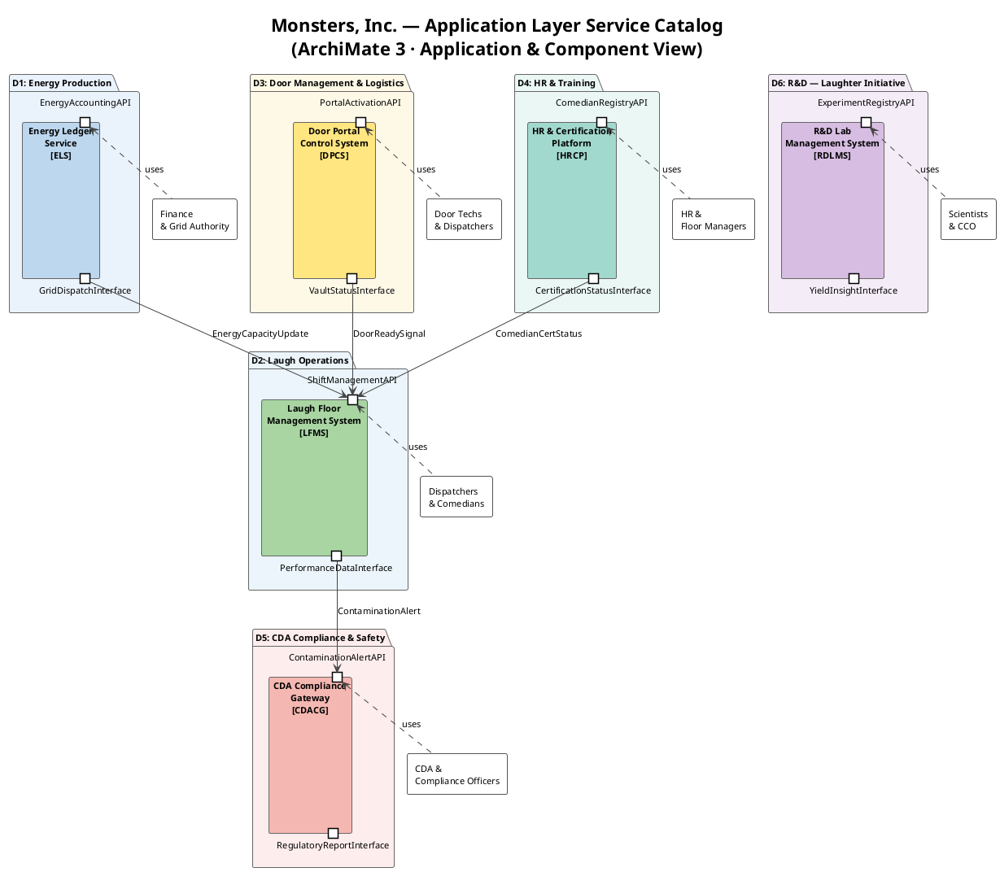
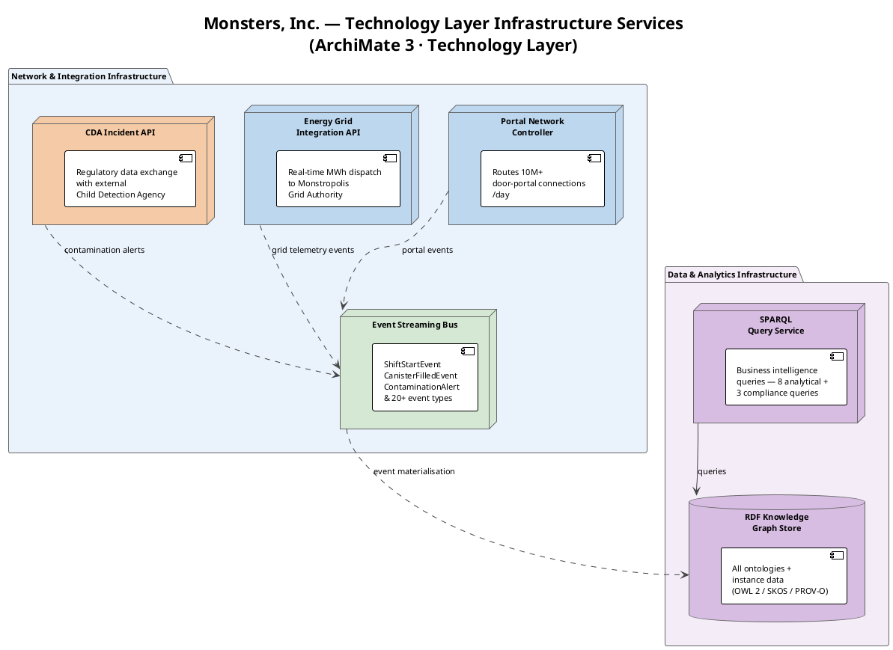
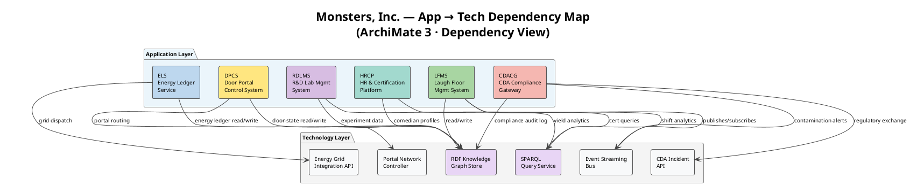

# Service Catalog — ArchiMate Application & Technology Layers

> **View:** Application & Technology | **Standard:** ArchiMate 3 | **Audience:** IT Architects, CTO, Operations

The Monsters, Inc. service catalog documents every application and technology service that realises the enterprise's six operational domains, from the Laugh Floor Management System that drives core revenue capture to the CDA Compliance Gateway that enforces cross-domain regulatory obligations. Together these twelve services — six application-layer and six technology-layer — form the complete software estate supporting 10 million daily door-portal interactions, real-time energy dispatch to the Monstropolis Grid, and continuous regulatory compliance with the Child Detection Agency.

**Navigation:** [← 06 Data Lineage](06-data-lineage.md) | [→ 08 Glossary](08-glossary.md) | [All Views →](../README.md)

---

## The Catalog as Queryable RDF

These twelve services are no longer prose-only: each is now a real RDF individual in `ontologies/mi-governance.ttl`, typed as `mi:ApplicationService` or `mi:TechnologyService` and carrying `mi:servesDomain`, `mi:accessibleToRole`, `mi:accessesDataset`, `mi:dependsOn`, and (where applicable) `mi:hasServiceAccount`. This means the dependency and access relationships drawn below can be queried directly — see governance queries GV1 (identity → service access) and GV5 (service dependency map) — rather than read off a diagram. The canonical application-service acronyms are **LFMS, DPCS, ELS, HRCP, CDACG, RDLMS**, matching the RDF exactly.

<!-- excerpt-from: ontologies/mi-governance.ttl -->
```turtle
mi:LFMS a mi:ApplicationService ; rdfs:label "Laugh Floor Management System" ;
    mi:servesDomain mi:LaughOperations ; mi:accessibleToRole mi:FloorManagerRole, mi:CCO ;
    mi:accessesDataset mi:PerformanceRecordsDataset, mi:ChildProfiles ; mi:hasServiceAccount mi:SA_AgentOrchestrator ;
    mi:dependsOn mi:RDFKnowledgeGraphStore, mi:EventStreamingBus .
```
[Full file → ../ontologies/mi-governance.ttl](../ontologies/mi-governance.ttl)

See [14 Data Governance, Identity & Access](14-data-governance.md) for the full identity, classification, and ODRL policy model built on this catalog.

---

## Diagram 1: Application Layer — Services & Components

Each application service is shown as an ArchiMate-style component with its provided interface (what it exposes to consumers) and its required interface (what it needs from the technology layer). Colour coding maps each service to its owning domain.



---

## Diagram 2: Technology Layer — Infrastructure Services

The technology layer exposes six platform services consumed by application services. Each node represents a distinct infrastructure concern — portal routing, energy telemetry, semantic data, analytics, regulatory exchange, and event streaming.



---

## Diagram 3: Dependency Map — Application Services to Technology Services

This diagram makes explicit which application services rely on which technology services. Every application service consumes the RDF Knowledge Graph Store as its system-of-record; domain-specific services layer additional technology dependencies on top.



---

## Service Inventory

### Application Services

| Service | Domain | Key Functions | External Integration | SLA |
|---------|--------|---------------|---------------------|-----|
| Laugh Floor Management System (LFMS) | D2 — Laugh Operations | • Shift scheduling and comedian assignment<br>• Door activation request dispatch<br>• Real-time laugh-yield monitoring | Door Portal Control System (inbound door-ready signal), Energy Ledger Service (capacity updates) | 99.99% |
| Door Portal Control System (DPCS) | D3 — Door Management & Logistics | • Vault retrieval and door assignment<br>• Portal activation and quality-check routing<br>• Post-shift door return and decommission workflow | Portal Network Controller (routing), Laugh Floor Management System (door-ready signal) | 99.95% |
| Energy Ledger Service (ELS) | D1 — Energy Production | • Real-time canister fill-level accounting<br>• MWh conversion and grid dispatch authorisation<br>• Energy audit trail per shift and comedian | Monstropolis Grid Authority (EGIA), CDA Compliance Gateway (energy-threshold alerts) | 99.99% |
| HR & Certification Platform (HRCP) | D4 — HR & Training | • Comedian registry and certification lifecycle<br>• Training programme tracking and exam scoring<br>• Certification expiry alerts to LFMS | LFMS (cert-status feed), CDA Compliance Gateway (certification evidence for audits) | 99.5% |
| CDA Compliance Gateway (CDACG) | D5 — CDA Compliance & Safety | • Real-time contamination-alert ingestion and routing<br>• Regulatory incident report generation and submission<br>• Cross-domain compliance audit log | Child Detection Agency Incident API (external), Event Streaming Bus (ContaminationAlert events) | 99.99% |
| R&D Lab Management System (RDLMS) | D6 — R&D Laughter Initiative | • Experiment registration and protocol tracking<br>• Laugh-yield data capture for technique trials<br>• Insight publication to operations via LFMS feed | RDF Knowledge Graph Store (experiment ontology), SPARQL Query Service (yield analytics) | 98% |

---

### Technology Services

| Service | Type | Serves | Throughput Target |
|---------|------|--------|-------------------|
| Portal Network Controller | Network routing service | DPCS — routes all door-portal activation and deactivation signals | 10 million portal connections per day; < 50 ms activation latency |
| Energy Grid Integration API | External integration API | ELS — dispatches confirmed MWh totals to Monstropolis Grid Authority | 288 dispatch cycles per day (every 5 minutes); 99.99% delivery guarantee |
| RDF Knowledge Graph Store | Semantic data store (OWL 2 / SKOS / PROV-O / DCAT 3) | All six application services — single system-of-record for entities, relationships, and provenance | 50 000 RDF read operations/min; 5 000 write operations/min |
| SPARQL Query Service | Analytics query engine | LFMS, HRCP, RDLMS, CDACG — executes 8 business queries and 3 compliance queries | 200 concurrent query sessions; < 2 s for standard analytical queries |
| CDA Incident API | Regulatory exchange gateway | CDACG — bidirectional incident data exchange with the external Child Detection Agency | Up to 500 contamination incident reports per year; sub-1-minute alert delivery |
| Event Streaming Bus | Asynchronous event bus | LFMS, CDACG, ELS, and infrastructure layer — distributes ShiftStartEvent, CanisterFilledEvent, ContaminationAlert, and 20+ event types | 1 million events per hour peak; at-least-once delivery, ordered per aggregate |

---

## Why This Matters

The service catalog is the IT architecture's counterpart to the capability map: where the capability map declares *what* Monsters, Inc. must be able to do, the service catalog declares *what software makes it possible* — creating the accountability link between business intent and deployable systems. By making technology dependencies explicit in the dependency map, architects can trace a compliance failure at the CDA Compliance Gateway back through the Event Streaming Bus and RDF Knowledge Graph Store to the originating comedian assignment in LFMS, enabling both root-cause analysis and targeted SLA negotiation. The 99.99% SLA cluster on LFMS, ELS, and CDACG reflects the regulatory and revenue consequence of outages in those services: a single missed shift represents lost laughter energy that cannot be recovered, and a delayed contamination alert carries direct CDA regulatory liability.

---

## Cross-References

- [02 Capability Map](02-capability-map.md) — capabilities realised by these application services (LFMS realises Laugh Energy Capture; DPCS realises Door Portal Operations)
- [05 Data Catalog](05-data-catalog.md) — datasets served by ELS (EnergyLedger dataset) and HRCP (ComedianRegistry dataset)
- [09 Constraints & Queries](09-constraints-queries.md) — the SPARQL Query Service executes all eight business queries and three compliance queries defined in that view
