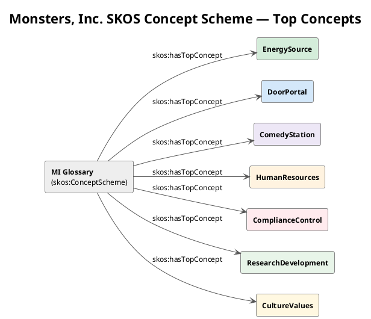
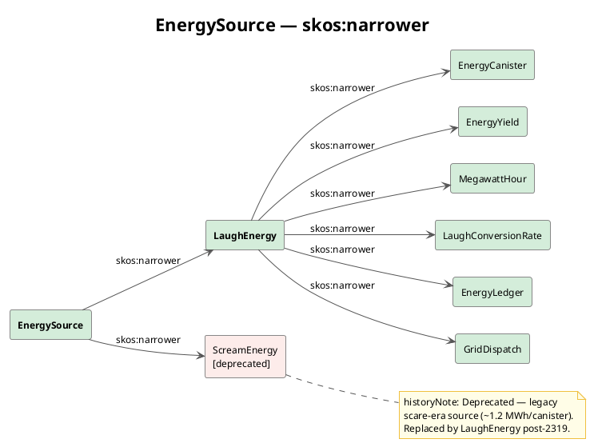
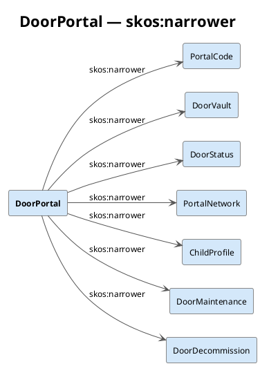
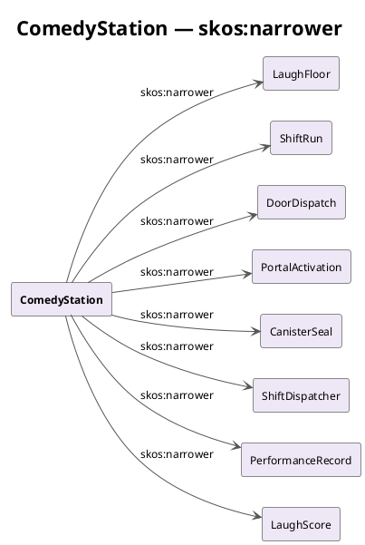
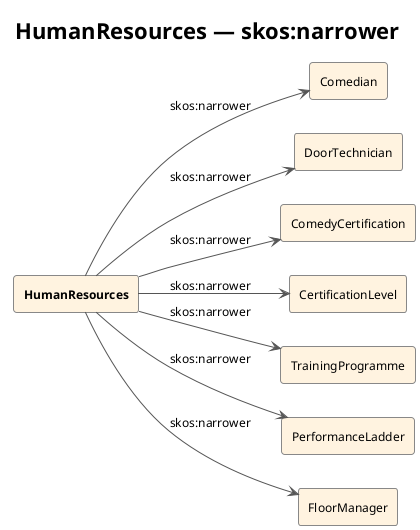
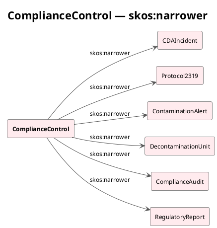
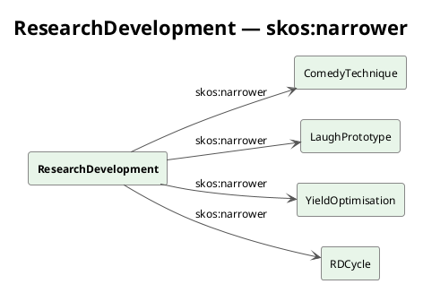
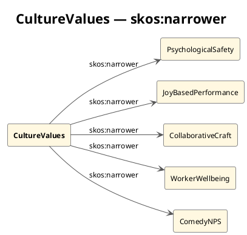

# Controlled Vocabulary & Glossary — SKOS

> **View:** Vocabulary | **Standard:** SKOS (W3C) | **Audience:** All stakeholders

[← 07 Service Catalog](07-service-catalog.md) | [→ 09 Constraints & Queries](09-constraints-queries.md) | [All Views →](../README.md)

---

## Overview

The Monsters, Inc. controlled vocabulary is formalised as a SKOS (Simple Knowledge Organisation System) concept scheme. It provides a shared, machine-readable terminology that unambiguously names every entity, process, role, and control concept used across the enterprise architecture. By anchoring all six domains to a single vocabulary, downstream consumers — SPARQL queries, SHACL shapes, R2RML mappings, and reporting tools — all resolve the same term to the same meaning.

---

## SKOS Concept Hierarchy

The overview below shows all seven top concepts as members of the concept scheme. The subsequent diagrams expand each top concept with its `skos:narrower` members.

### Overview — Six Top Concepts



### EnergySource — Narrower Concepts

`EnergySource` is the top concept; `LaughEnergy` and `ScreamEnergy` both sit directly under it (`skos:broader EnergySource`). `LaughEnergy` in turn has its own six narrowers.



### DoorPortal — Narrower Concepts



### ComedyStation — Narrower Concepts



### HumanResources — Narrower Concepts



### ComplianceControl — Narrower Concepts



### ResearchDevelopment — Narrower Concepts



### CultureValues — Narrower Concepts



---

## Top Concept Overview

| Concept URI | prefLabel | Definition (1 sentence) |
|---|---|---|
| `mi:LaughEnergy` | Laugh Energy | The primary energy product of Monsters, Inc., generated from harvested child laughter at approximately 14.5 MWh per canister. |
| `mi:DoorPortal` | Door Portal | A magical portal door linking the monster world to a specific child's bedroom, activated during comedy sessions. |
| `mi:ComedyStation` | Comedy Station | One of the 100 designated Laugh Floor workstations where a Comedian performs routines to capture child laughter energy. |
| `mi:HumanResources` | Human Resources | The organisational domain covering comedian certification, door technician roles, training programmes, and career progression. |
| `mi:ComplianceControl` | Compliance Control | The set of CDA-imposed controls, incidents, and reporting obligations governing human-world interactions. |
| `mi:ResearchDevelopment` | Research & Development | The innovation domain that designs, tests, and approves comedy techniques to maximise laugh energy yield. |

---

## Full Concept Listing

The table below covers all 52 concepts defined in `mi-glossary.ttl`, with their alt-labels and key relationships.

| Concept | altLabel(s) | skos:broader | Key skos:related |
|---|---|---|---|
| `mi:EnergySource` | Energy Source | *(top concept)* | LaughEnergy, ScreamEnergy |
| `mi:LaughEnergy` | LE, Laughter Energy | EnergySource | LaughScore, EnergyYield |
| `mi:ScreamEnergy` | SE, Scare Energy | EnergySource | Protocol2319, EnergyCanister |
| `mi:EnergyCanister` | Laugh Canister, Canister | LaughEnergy | EnergyYield, CanisterSeal |
| `mi:EnergyYield` | Yield, Output | LaughEnergy | LaughScore, LaughConversionRate |
| `mi:MegawattHour` | MWh | LaughEnergy | EnergyYield, EnergyCanister |
| `mi:LaughConversionRate` | LCR, Conversion Rate | LaughEnergy | LaughScore, YieldOptimisation |
| `mi:EnergyLedgerConcept` | Ledger, Energy Register | LaughEnergy | GridDispatch, EnergyCanister |
| `mi:GridDispatch` | Power Dispatch, Dispatch | LaughEnergy | EnergyCanister, EnergyLedgerConcept |
| `mi:DoorPortal` | Child Door, Portal | *(top concept)* | DoorDispatch, PortalActivation |
| `mi:PortalCode` | Door Code, PC | DoorPortal | PortalNetwork, ChildProfile |
| `mi:DoorVault` | Vault, Door Storage | DoorPortal | DoorDispatch, DoorMaintenance |
| `mi:DoorStatus` | Operational Status | DoorPortal | DoorMaintenance, DoorDecommission |
| `mi:PortalNetwork` | Door Network, Door Inventory | DoorPortal | PortalCode, DoorVault |
| `mi:ChildProfile` | Target Profile | DoorPortal | PortalCode, LaughScore |
| `mi:DoorMaintenance` | Preventive Maintenance, PM | DoorPortal | DoorStatus, DoorTechnician |
| `mi:DoorDecommission` | Decommission | DoorPortal | DoorStatus, PortalNetwork |
| `mi:ComedyStation` | Laugh Floor Station, Workstation | *(top concept)* | Comedian, DoorPortal |
| `mi:LaughFloor` | Comedy Floor | ComedyStation | ShiftRun, ShiftDispatcher |
| `mi:ShiftRun` | Production Shift, Shift | ComedyStation | DoorDispatch, LaughFloor |
| `mi:DoorDispatch` | Door Assignment | ComedyStation | DoorPortal, DoorTechnician |
| `mi:PortalActivation` | Door Activation | ComedyStation | DoorPortal, CanisterSeal |
| `mi:CanisterSeal` | Seal | ComedyStation | EnergyCanister, GridDispatch |
| `mi:ShiftDispatcher` | Floor Dispatcher | ComedyStation | ShiftRun, FloorManager |
| `mi:PerformanceRecord` | Daily PR, PR | ComedyStation | LaughScore, Comedian |
| `mi:LaughScore` | Comedy Score, LS | ComedyStation | EnergyYield, LaughConversionRate |
| `mi:HumanResources` | HR, People & Training | *(top concept)* | ComedyStation, ComplianceControl |
| `mi:Comedian` | Laugh Specialist, Comedy Agent | HumanResources | ComedyCertification, LaughFloor |
| `mi:DoorTechnician` | Tech, Portal Technician | HumanResources | DoorDispatch, DoorMaintenance |
| `mi:ComedyCertification` | Certification, Cert | HumanResources | CertificationLevel, TrainingProgramme |
| `mi:CertificationLevel` | Cert Level, Level | HumanResources | ComedyCertification, PerformanceLadder |
| `mi:TrainingProgram` | Training Program, Curriculum | HumanResources | ComedyCertification, Comedian |
| `mi:PerformanceLadder` | Career Ladder, Ladder | HumanResources | CertificationLevel, PerformanceRecord |
| `mi:FloorManager` | Shift Manager | HumanResources | ShiftDispatcher, LaughFloor |
| `mi:ComplianceControl` | CDA Compliance, Regulatory Control | *(top concept)* | DoorPortal, HumanResources |
| `mi:CDAIncident` | Incident, Reportable Event | ComplianceControl | Protocol2319, DoorStatus |
| `mi:Protocol2319` | 2319, White Sock Protocol | ComplianceControl | CDAIncident, ContaminationAlert |
| `mi:ContaminationAlert` | 2319 Alert, Alert | ComplianceControl | Protocol2319, DecontaminationUnit |
| `mi:DecontaminationUnit` | CDA Team, Decon Unit | ComplianceControl | Protocol2319, ComplianceAudit |
| `mi:ComplianceAudit` | CDA Audit, Audit | ComplianceControl | RegulatoryReport, DoorMaintenance |
| `mi:RegulatoryReport` | CDA Report, Monthly Submission | ComplianceControl | ComplianceAudit, CDAIncident |
| `mi:ResearchDevelopment` | R&D, Laughter Initiative | *(top concept)* | LaughEnergy, ComedyStation |
| `mi:ComedyTechnique` | Technique | ResearchDevelopment | LaughPrototype, LaughScore |
| `mi:LaughPrototype` | Prototype, R&D Prototype | ResearchDevelopment | ComedyTechnique, RDCycle |
| `mi:YieldOptimisation` | Yield Optimization, YO | ResearchDevelopment | LaughConversionRate, EnergyYield |
| `mi:RDCycle` | Research Cycle, Innovation Cycle | ResearchDevelopment | LaughPrototype, ComedyTechnique |
| `mi:CultureValues` | Cultural Principles | *(top concept)* | (narrowers only) |
| `mi:PsychologicalSafety` | Safety to Speak Up | CultureValues | WorkerWellbeing, CDAIncident |
| `mi:JoyBasedPerformance` | Laughter-First Culture | CultureValues | LaughEnergy, ScreamEnergy |
| `mi:CollaborativeCraft` | Team Comedy | CultureValues | PerformanceLadder |
| `mi:WorkerWellbeing` | Monster Welfare | CultureValues | PsychologicalSafety, PerformanceRecord |
| `mi:ComedyNPS` | Joy Net Promoter Score | CultureValues | JoyBasedPerformance |

---

## Turtle Artifact — mi-glossary.ttl

<!-- excerpt-from: ontologies/mi-glossary.ttl -->
```turtle
<https://vocab.monstersinc.com/glossary>
    a skos:ConceptScheme ;
    skos:prefLabel "Monsters, Inc. Controlled Vocabulary"@en ;
    skos:hasTopConcept mi:EnergySource ;
    skos:hasTopConcept mi:DoorPortal ;
    skos:hasTopConcept mi:ComedyStation ;
    skos:hasTopConcept mi:HumanResources ;
    skos:hasTopConcept mi:ComplianceControl ;
    skos:hasTopConcept mi:ResearchDevelopment ;
    skos:hasTopConcept mi:CultureValues .
```

> The full file is located at [`ontologies/mi-glossary.ttl`](../ontologies/mi-glossary.ttl) and contains all 52 concepts with prefLabels, altLabels, definitions, broader/narrower hierarchies, related links, and history notes.

---

## Why This Matters

A SKOS controlled vocabulary is the governance foundation that makes enterprise data coherent at scale: every system, query, and report references the same canonical term rather than a local alias, eliminating the drift that typically accumulates when six organisational domains evolve independently. For Monsters, Inc., anchoring the 52 core concepts — from `mi:LaughEnergy` to `mi:Protocol2319` — in a machine-readable scheme means that the MS IQ platform can reason over terminology alongside structure, enabling cross-domain analytics that would otherwise require brittle string-matching heuristics.

---

## Cross-References

- **[01 — Ontology & Data Model](01-domain-model.md):** The OWL classes defined in `mi-core.ttl` are the formal counterparts to the SKOS concepts defined here; `mi:Comedian` (OWL class) and `mi:Comedian` (SKOS concept) share a URI and are co-referential.
- **[09 — Constraints & Queries](09-constraints-queries.md):** SPARQL queries use SKOS `prefLabel` and `altLabel` values as human-readable labels in result sets; SHACL violation messages reference concept definitions for clarity.

---

*Document 08 of 16 — Monsters, Inc. Enterprise Architecture Reference*
