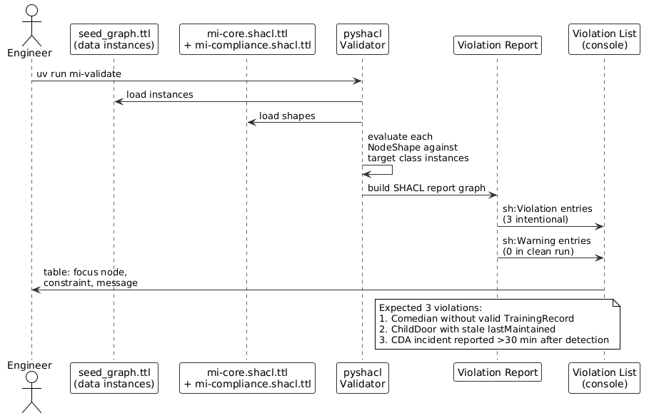
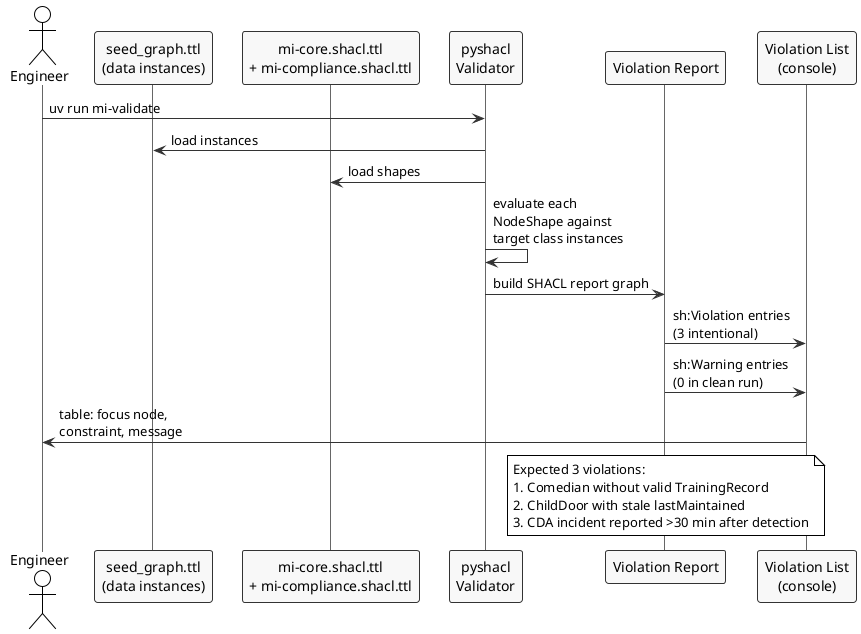

# Constraints & Business Queries — SHACL + SPARQL

> **View:** Constraint / Query | **Standard:** SHACL 1.0 + SPARQL 1.1 | **Audience:** Data Engineers, Compliance Officers

SHACL shapes define machine-executable rules that validate every instance in the Monsters, Inc. knowledge graph against operational and regulatory constraints. The 22 business-question SPARQL queries — alongside the compliance, agent-authority, human-centered, governance, and constitution suites — turn that same graph into actionable business intelligence, from comedian performance rankings and live floor maps to station throughput, training-programme coverage, and workforce-wellbeing aggregates.

> **Run it:** `make validate` — expected output: SHACL violation table showing exactly 3 intentional violations (one comedian without a current certification, one door with stale maintenance, one CDA incident reported >30 min after detection).
> **Run it:** `make query` — expected output: result tables for the 22 business questions covering comedian rankings, door maintenance status, CDA incident trends, live floor layout, shared profile anomalies, score drift, energy lineage, strategy traceability, the R&D pipeline, the scare→laughter energy-era transition, station throughput, training-programme coverage, door-technician span of control, and workforce wellbeing by dimension.

**Navigation:** [← 08 Glossary](08-glossary.md) | [→ 10 Entity Graph](10-entity-graph.md) | [All Views →](../README.md)

---

## 1. SHACL Validation Flow

The SHACL validator loads the seed graph and the two shape files, then produces a structured violation report. Any instance that violates a `sh:Violation`-severity constraint appears in the report; `sh:Warning`-severity violations are surfaced separately and do not block the pipeline.

<!-- diagram-image -->




---

## 2. SHACL Shapes Summary

| Shape | Target Class | Rule | Severity |
|---|---|---|---|
| `mi:ComedianCertShape` | `mi:Comedian` | `certLevel` 1–5 required; if `assignedStation` set, must have non-expired `TrainingRecord` | `sh:Violation` |
| `mi:DoorDispatchShape` | `mi:ChildDoor` | `doorStatus` must be `mi:active`; `lastMaintained` (xsd:date) required | `sh:Violation` |
| `mi:CanisterTransportShape` | `mi:LaughCanister` | `sealStatus = true`; `fillLevel` in [0.0, 1.0] | `sh:Violation` |
| `mi:CDAReportingShape` | `mi:CDAIncident` | `reportedAt` and `detectedAt` required; reporting delay ≤ 30 minutes | `sh:Violation` |
| `mi:ChildAgeShape` | `mi:ChildDoor` | Linked `ChildProfile.ageRange` must not start with "13" | `sh:Violation` |
| `mi:PerformanceRecordShape` | `mi:PerformanceRecord` | `comedian`, `date`, `laughScore` all required | `sh:Warning` |

---

## 3. Core SHACL Shapes — `shapes/mi-core.shacl.ttl`

All six core NodeShapes (summarised above) are maintained in the source file. A representative excerpt — the `ComedianCertShape` cardinality and range constraint on `certLevel` — appears below.

<!-- excerpt-from: shapes/mi-core.shacl.ttl -->
```turtle
mi:ComedianCertShape a sh:NodeShape ;
    sh:targetClass mi:Comedian ;
    sh:name "Comedian Certification Shape" ;

    sh:property [
        sh:path mi:certLevel ;
        sh:minCount 1 ;
        sh:datatype xsd:integer ;
        sh:minInclusive 1 ;
        sh:maxInclusive 5 ;
        sh:severity sh:Violation ;
    ] .
```

> **Full artifact:** [shapes/mi-core.shacl.ttl](../shapes/mi-core.shacl.ttl) — generated/maintained as the single source of truth.

---

## 4. CDA Compliance SHACL Shapes — `shapes/mi-compliance.shacl.ttl`

The three CDA-specific shapes (C1–C3) are maintained in the source file. A representative excerpt — the `DoorContaminationShape` SPARQL rule that requires any door involved in an incident to be quarantined — appears below.

<!-- excerpt-from: shapes/mi-compliance.shacl.ttl -->
```turtle
mi:DoorContaminationShape a sh:NodeShape ;
    sh:targetClass mi:ChildDoor ;
    sh:name "Door Contamination Quarantine Shape" ;

    sh:sparql [
        sh:severity sh:Violation ;
        sh:prefixes mi: ;
    ] .
```

> **Full artifact:** [shapes/mi-compliance.shacl.ttl](../shapes/mi-compliance.shacl.ttl) — generated/maintained as the single source of truth.

---

## 5. Business Queries Overview

| ID | Business Question | Domain | Key Technique |
|---|---|---|---|
| Q1 | Who are the top 10 comedians by energy yield this month? | D2 Laugh Ops | `SUM`, `GROUP BY`, `FILTER` on `NOW()` month/year |
| Q2 | Which doors are past their 180-day maintenance window? | D3 Door Mgmt | Date arithmetic with `BIND`, duration comparison |
| Q3 | How many CDA incidents occurred per quarter (last 4 quarters)? | D5 CDA | `BIND` with `FLOOR((MONTH - 1) / 3) + 1`, `COUNT` |
| Q4 | How does laugh-to-energy conversion vary by cert level? | D2 Laugh Ops | `AVG` of `energyGenerated / laughScore`, `GROUP BY certLevel` |
| Q5 | Which certifications expire in the next 30 days? | D4 HR | Double `FILTER` on `expiresAt` > `NOW()` and < `NOW() + P30D` |
| Q6 | What is the monthly energy output trend over the last 12 months? | D1 Energy | `SUM` by `YEAR + MONTH`, `FILTER` on date range |
| Q7 | Are any child profiles assigned to more than one door? | D3 Door Mgmt | `COUNT`, `HAVING COUNT > 1`, integrity check |
| Q8 | What is the full PROV-O lineage for an EnergyUnit? | D1 Energy | `prov:wasDerivedFrom`, `prov:wasAssociatedWith`, `OPTIONAL` chains |
| Q9 | Which shared profiles span multiple doors — full detail? | D3 Door Mgmt | Subquery for shared profiles, `OPTIONAL` joins to profile attributes |
| Q10 | What is the live operational layout of the Laugh Floor? | D2 Laugh Ops | Multi-hop join: Station → Comedian → Door → ChildProfile |
| Q11 | Which stations are staffed but have no active door? | D2 Laugh Ops | `FILTER NOT EXISTS` on `mi:activeDoor` |
| Q12 | How many doors are in each operational status? | D3 Door Mgmt | `COUNT` `GROUP BY doorStatus` |
| Q13 | Which comedians are trending above/below their historical baseline? | D2 Laugh Ops | `AVG` vs `mi:currentLaughScore`, computed `scoreDrift` |
| Q14 | Are there comedians with no performance records on file? | D4 HR | `FILTER NOT EXISTS` on `mi:PerformanceRecord` |
| Q15 | Who are the direct reports to the CEO? | D4 HR | `mi:reportsTo` traversal, `OPTIONAL` role and department |
| Q16 | Which capabilities and processes realise each strategic goal? | Cross-domain | Strategy traceability: goal → capability → process → owning domain |

---

## 6. Business Queries — `queries/business-questions.sparql`

All twenty-two business questions (Q1–Q22) — covering energy production, maintenance compliance, CDA incident trends, PROV-O lineage, operational layout, data integrity, score drift, org structure, strategy traceability, the R&D pipeline (Q17), the scare→laughter energy-era transition (Q18), station throughput (Q19), training-programme coverage (Q20), door-technician span of control (Q21), and workforce wellbeing by dimension (Q22) — are maintained in the source file. A representative excerpt (Q1) appears below.

<!-- excerpt-from: queries/business-questions.sparql -->
```sparql
# Q1: Top 10 comedians by energy yield this month

PREFIX mi:  <https://vocab.monstersinc.com/ontology#>
PREFIX xsd: <http://www.w3.org/2001/XMLSchema#>

SELECT ?name ?certLevel (SUM(?mwh) AS ?totalMWh)
WHERE {
    ?comedian a mi:Comedian ;
              mi:name ?name ;
              mi:certLevel ?certLevel .
}
```

> **Full artifact:** [queries/business-questions.sparql](../queries/business-questions.sparql) — generated/maintained as the single source of truth.

---

## 7. Compliance Violation Queries — `queries/compliance-violations.sparql`

These queries mirror the SHACL constraints in pure SPARQL, enabling ad-hoc auditing without a SHACL validator. The full suite (CV1–CV7) is maintained in the source file. A representative excerpt (CV1) appears below.

<!-- excerpt-from: queries/compliance-violations.sparql -->
```sparql
# CV1: Comedians assigned to stations without valid certification

PREFIX mi:  <https://vocab.monstersinc.com/ontology#>
PREFIX xsd: <http://www.w3.org/2001/XMLSchema#>

SELECT ?comedian ?name ?station
WHERE {
    ?comedian a mi:Comedian ;
              mi:name ?name ;
              mi:assignedStation ?station .
}
```

> **Full artifact:** [queries/compliance-violations.sparql](../queries/compliance-violations.sparql) — generated/maintained as the single source of truth.

---

## 8. Why This Matters

SHACL and SPARQL turn the Monsters, Inc. knowledge graph from a passive schema into an active compliance engine: every data load is automatically validated against six operational rules and three CDA regulatory constraints, with the three intentional seed violations serving as a living test fixture. The 22 business queries close the loop — covering every domain from D1 Energy to D6 R&D — extracting actionable intelligence directly from the same graph: no ETL, no duplication. Q9 onward extend the picture to the live floor layout, shared-profile anomalies, score drift detection, the executive reporting chain, goal-to-capability strategy traceability, the R&D prototype pipeline, the scare→laughter energy-era transition, station throughput, training-programme coverage, door-technician span of control, and workforce wellbeing by dimension, demonstrating how a single semantic layer serves governance, operations, and analytics simultaneously.

---

## Cross-References

- **[01 Domain Model](01-domain-model.md)** — defines the 12 OWL classes that SHACL shapes target (`mi:Comedian`, `mi:ChildDoor`, `mi:LaughCanister`, `mi:CDAIncident`, `mi:PerformanceRecord`)
- **[06 Provenance](06-data-lineage.md)** — the PROV-O graph that Q8 traverses: `EnergyUnit → LaughCanister → LaughCollectionActivity → Comedian + Station + Door`
- **[11 DB Schema](11-db-schema.md)** — R2RML mappings produce the RDF instances that these SHACL shapes validate and these SPARQL queries analyse
