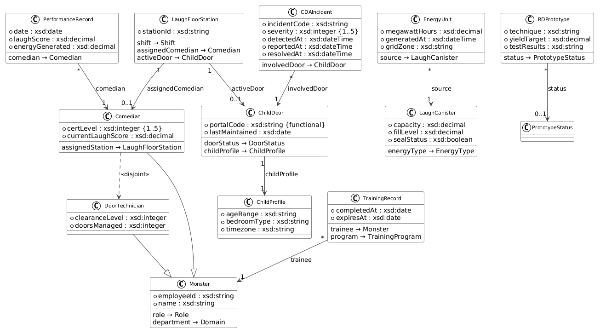
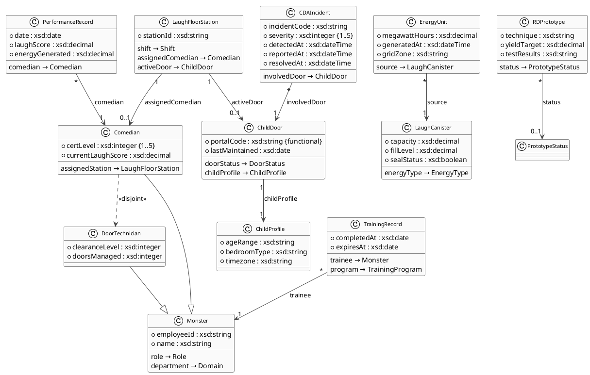
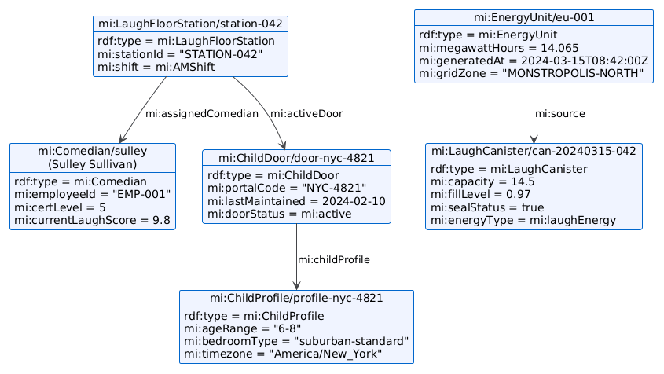
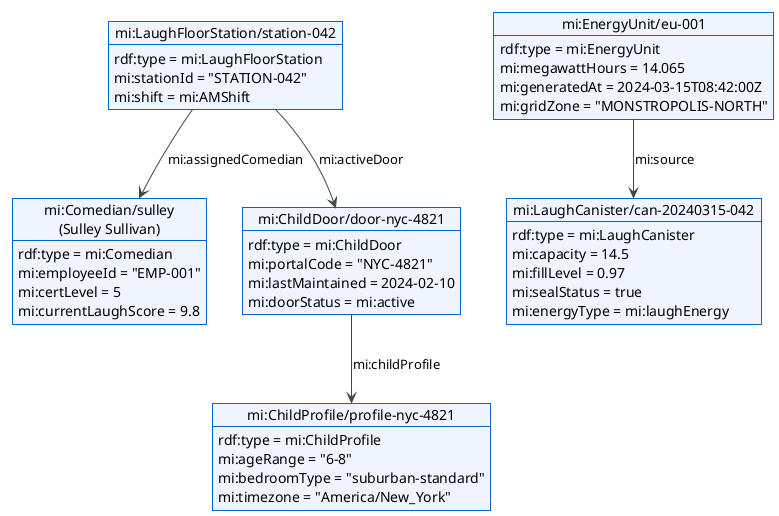
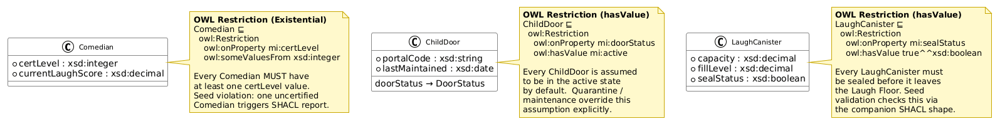

# 10 — Entity Graph — OWL Entity Relationship & RDF Graph

| View | Standard | Audience |
|------|----------|----------|
| Entity / Data | OWL 2 + UML + RDF | Data Architects, Developers |

The entity graph presents all twelve OWL classes as a unified relational model, exposing both the structural schema — with typed properties and association cardinalities — and concrete RDF instance data drawn from an operational shift. It is the bridge between the abstract ontology definition in `mi-core.ttl` and the live triples that populate the knowledge graph at runtime.

**Navigation:** [← 09 Constraints & Queries](09-constraints-queries.md) | [→ 11 DB Schema](11-db-schema.md) | [All Views →](../README.md)

---

## Diagram 1: Full UML Class Diagram with Properties and Cardinalities

<!-- diagram-image -->

---

## Diagram 2: RDF Graph Fragment — Shift AM-20240315

This object diagram shows concrete triples from a single AM shift, illustrating how the abstract schema materialises into linked instance data in the knowledge graph.

<!-- diagram-image -->

---

## Diagram 3: OWL Restriction Patterns

This diagram shows how three key OWL restriction axioms constrain class membership, translating formal Description Logic axioms into visual annotations on the affected class boxes.

```plantuml
@startuml OWL-Restrictions
!theme plain
skinparam backgroundColor #FFFFFF
skinparam classBackgroundColor #FAFAFA
skinparam classBorderColor #888888
skinparam arrowColor #444444
skinparam noteBackgroundColor #FFF9CC
skinparam noteBorderColor #C9A800
skinparam classFontSize 11

class Comedian {
  + certLevel : xsd:integer
  + currentLaughScore : xsd:decimal
}

class ChildDoor {
  + portalCode : xsd:string
  + lastMaintained : xsd:date
  --
  doorStatus → DoorStatus
}

class LaughCanister {
  + capacity : xsd:decimal
  + fillLevel : xsd:decimal
  + sealStatus : xsd:boolean
}

note right of Comedian
  **OWL Restriction (Existential)**
  Comedian ⊑
    owl:Restriction
      owl:onProperty mi:certLevel
      owl:someValuesFrom xsd:integer

  Every Comedian MUST have
  at least one certLevel value.
  Seed violation: one uncertified
  Comedian triggers SHACL report.
end note

note right of ChildDoor
  **OWL Restriction (hasValue)**
  ChildDoor ⊑
    owl:Restriction
      owl:onProperty mi:doorStatus
      owl:hasValue mi:active

  Every ChildDoor is assumed
  to be in the active state
  by default.  Quarantine /
  maintenance override this
  assumption explicitly.
end note

note right of LaughCanister
  **OWL Restriction (hasValue)**
  LaughCanister ⊑
    owl:Restriction
      owl:onProperty mi:sealStatus
      owl:hasValue true^^xsd:boolean

  Every LaughCanister must
  be sealed before it leaves
  the Laugh Floor. Seed
  validation checks this via
  the companion SHACL shape.
end note

@enduml
```

<!-- diagram-image -->

---

## Entity Inventory

This reprises the twelve core classes from [Doc 01](01-domain-model.md) — the schema authority — and adds the dimension Doc 01 omits: the **approximate seed instance count** per class. For the full datatype-vs-object-property split, see Doc 01's Class and Property Inventory; the table here is the instance-graph view.

| Class | Domain | Key Properties | Associations | Instances in Seed |
|-------|--------|----------------|--------------|-------------------|
| `mi:Monster` | Root person class | `employeeId`, `name` | `role`, `department` | — (abstract superclass) |
| `mi:Comedian` | D2 — Laugh Operations | `certLevel`, `currentLaughScore` | `assignedStation → LaughFloorStation` | ~20 |
| `mi:DoorTechnician` | D3 — Door Management | `clearanceLevel`, `doorsManaged` | (inherits `role`, `department`) | ~10 |
| `mi:ChildDoor` | D3 — Door Management | `portalCode`, `lastMaintained`, `doorStatus` | `childProfile → ChildProfile` | ~50 |
| `mi:ChildProfile` | D3 — Door Management | `ageRange`, `bedroomType`, `timezone` | linked 1-to-1 from `ChildDoor` | ~50 |
| `mi:LaughCanister` | D1 — Energy Production | `capacity`, `fillLevel`, `sealStatus`, `energyType` | source of `EnergyUnit` | ~100 |
| `mi:EnergyUnit` | D1 — Energy Production | `megawattHours`, `generatedAt`, `gridZone` | `source → LaughCanister` | ~100 |
| `mi:LaughFloorStation` | D2 — Laugh Operations | `stationId`, `shift` | `assignedComedian`, `activeDoor` | ~100 |
| `mi:CDAIncident` | D5 — CDA Compliance | `incidentCode`, `severity`, `detectedAt`, `reportedAt`, `resolvedAt` | `involvedDoor → ChildDoor` | ~5 |
| `mi:TrainingRecord` | D4 — HR & Training | `completedAt`, `expiresAt` | `trainee → Monster`, `program → TrainingProgram` | ~30 |
| `mi:PerformanceRecord` | D2 — Laugh Operations | `date`, `laughScore`, `energyGenerated` | `comedian → Comedian` | ~200 |
| `mi:RDPrototype` | D6 — R&D Laughter | `technique`, `yieldTarget`, `testResults` | `status → PrototypeStatus` | ~5 |

---

## Why This Matters

The entity graph is the translation layer that makes the semantic model actionable: it exposes both the schema constraints an application must satisfy when writing data and the concrete link structure that SPARQL queries traverse at runtime. Without this view, ontology definitions remain abstract, and developers lack the cardinality and domain context needed to design conformant data loaders or query plans. For MS IQ specifically, this diagram serves as the canonical import contract — the platform reads the same `mi-core.ttl` triples to infer join paths, detect missing mandatory properties, and surface relationship traversals in its reasoning engine.

---

## Cross-references

- [01 Domain Model](01-domain-model.md) — OWL class hierarchy and domain partitioning from which all 12 classes originate
- [04 Ontology BPM](04-ontology-bpm.md) — business processes that create and update these entity instances during operational execution
- [11 DB Schema](11-db-schema.md) — relational representation of the three primary entity tables and the R2RML mappings that lift them into RDF
