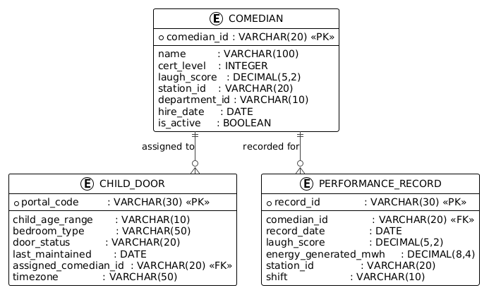
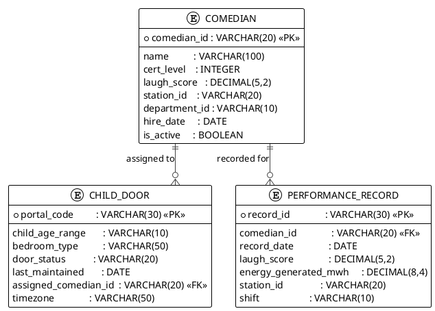
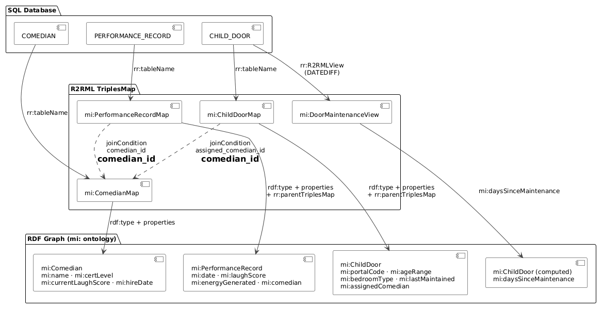
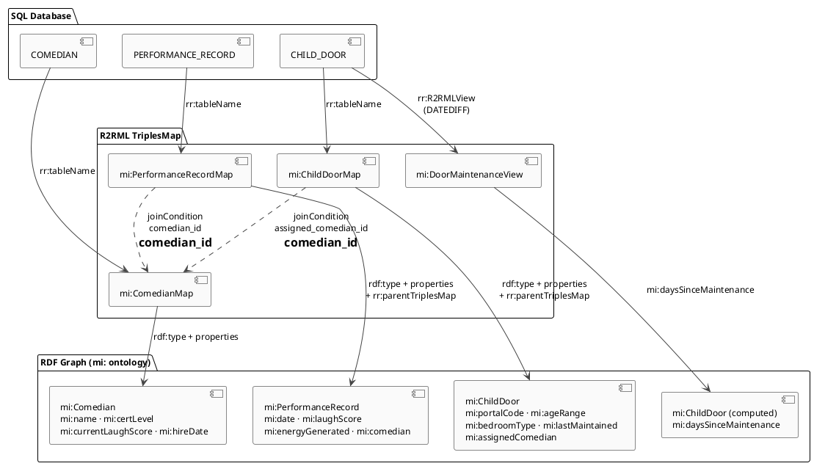

# 11 — Relational Database Schema & R2RML Mapping

| View | Standard | Audience |
|------|----------|----------|
| Data / Persistence | SQL + R2RML (W3C) | Data Engineers, DBAs |

The operational relational database persists three core entities — comedians, child bedroom doors, and performance records — using a normalised SQL schema. R2RML (Relational to RDF Mapping Language) lifts these rows into the ontology graph defined in `mi-core.ttl`, enabling SPARQL queries and SHACL validation against the same data that drives day-to-day laugh operations.

**Navigation:** [← 10 Entity Graph](10-entity-graph.md) | [→ 12 Unstructured Docs](12-unstructured-docs.md) | [All Views →](../README.md)

---

## ER Diagram

<!-- diagram-image -->




---

## R2RML Mapping Flow

<!-- diagram-image -->




---

## SQL DDL

```sql
CREATE TABLE COMEDIAN (
    comedian_id   VARCHAR(20)    PRIMARY KEY,
    name          VARCHAR(100)   NOT NULL,
    cert_level    INTEGER        CHECK (cert_level BETWEEN 1 AND 5),
    laugh_score   DECIMAL(5,2),
    station_id    VARCHAR(20),
    department_id VARCHAR(10),
    hire_date     DATE,
    is_active     BOOLEAN        DEFAULT TRUE
);

CREATE TABLE CHILD_DOOR (
    portal_code          VARCHAR(30)  PRIMARY KEY,
    child_age_range      VARCHAR(10)  NOT NULL,
    bedroom_type         VARCHAR(50),
    door_status          VARCHAR(20),
    last_maintained      DATE,
    assigned_comedian_id VARCHAR(20),
    timezone             VARCHAR(50),
    FOREIGN KEY (assigned_comedian_id) REFERENCES COMEDIAN(comedian_id)
);

CREATE TABLE PERFORMANCE_RECORD (
    record_id            VARCHAR(30)   PRIMARY KEY,
    comedian_id          VARCHAR(20)   NOT NULL,
    record_date          DATE          NOT NULL,
    laugh_score          DECIMAL(5,2),
    energy_generated_mwh DECIMAL(8,4),
    station_id           VARCHAR(20),
    shift                VARCHAR(10),
    FOREIGN KEY (comedian_id) REFERENCES COMEDIAN(comedian_id)
);
```

---

## R2RML Mapping (Turtle)

The full R2RML mapping — four TriplesMaps (COMEDIAN, CHILD_DOOR, PERFORMANCE_RECORD, plus the computed `DoorMaintenanceView`) with FK join conditions and canonical-IRI normalisation — is maintained in the source file. A representative excerpt (the COMEDIAN map's `rr:R2RMLView` and subject map) appears below.

<!-- excerpt-from: mappings/mi-db.r2rml.ttl -->
```turtle
mi:ComedianMap a rr:TriplesMap ;
    rr:logicalTable [
        a rr:R2RMLView ;
        rr:sqlQuery "SELECT *, LOWER(comedian_id) AS comedian_key, LOWER(REPLACE(station_id,'-','')) AS station_key FROM COMEDIAN" ;
    ] ;

    rr:subjectMap [
        rr:template "https://vocab.monstersinc.com/comedian/{comedian_key}" ;
        rr:class mi:Comedian ;
    ] ;
```

> **Full artifact:** [mappings/mi-db.r2rml.ttl](../mappings/mi-db.r2rml.ttl) — generated/maintained as the single source of truth.

---

## Column-to-RDF Mapping Table

### COMEDIAN

| SQL Column | SQL Type | RDF Predicate | RDF Datatype |
|---|---|---|---|
| `comedian_id` | VARCHAR(20) PK | IRI template (subject) | — |
| `name` | VARCHAR(100) | `mi:name` | xsd:string |
| `cert_level` | INTEGER | `mi:certLevel` | xsd:integer |
| `laugh_score` | DECIMAL(5,2) | `mi:currentLaughScore` | xsd:decimal |
| `station_id` | VARCHAR(20) | `mi:stationId` | xsd:string |
| `department_id` | VARCHAR(10) | — (not mapped) | — |
| `hire_date` | DATE | `mi:hireDate` | xsd:date |
| `is_active` | BOOLEAN | `mi:isActive` | xsd:boolean |

### CHILD_DOOR

| SQL Column | SQL Type | RDF Predicate | RDF Datatype |
|---|---|---|---|
| `portal_code` | VARCHAR(30) PK | IRI template (subject) + `mi:portalCode` | xsd:string |
| `child_age_range` | VARCHAR(10) | `mi:ageRange` | xsd:string |
| `bedroom_type` | VARCHAR(50) | `mi:bedroomType` | xsd:string |
| `door_status` | VARCHAR(20) | — (not mapped) | — |
| `last_maintained` | DATE | `mi:lastMaintained` | xsd:date |
| `assigned_comedian_id` | VARCHAR(20) FK | `mi:assignedComedian` (object link) | — |
| `timezone` | VARCHAR(50) | `mi:timezone` | xsd:string |
| *(computed)* | — | `mi:daysSinceMaintenance` | xsd:integer |

### PERFORMANCE_RECORD

| SQL Column | SQL Type | RDF Predicate | RDF Datatype |
|---|---|---|---|
| `record_id` | VARCHAR(30) PK | IRI template (subject) | — |
| `comedian_id` | VARCHAR(20) FK | `mi:comedian` (object link) | — |
| `record_date` | DATE | `mi:date` | xsd:date |
| `laugh_score` | DECIMAL(5,2) | `mi:laughScore` | xsd:decimal |
| `energy_generated_mwh` | DECIMAL(8,4) | `mi:energyGenerated` | xsd:decimal |
| `station_id` | VARCHAR(20) | — (not mapped) | — |
| `shift` | VARCHAR(10) | — (not mapped) | — |

---

## Why This Matters

The R2RML layer eliminates a manual ETL step: once deployed, any compliant R2RML processor (e.g., Ontop, RMLMapper) materialises or virtually serves the operational database as a live RDF graph — meaning SPARQL queries in `business-questions.sparql` can run directly against production data without a separate sync pipeline. The computed `mi:DoorMaintenanceView` demonstrates that R2RML is not limited to column mirrors; SQL expressions can derive semantically rich properties (like staleness) that have no direct relational counterpart. Together, the three TriplesMaps and the view form the persistence bridge that grounds the abstract ontology in the observable, auditable state of Monsters, Inc.'s operational systems.

---

## Cross-references

- [10 Entity Graph](10-entity-graph.md) — entity model these tables persist
- [09 Constraints](09-constraints-queries.md) — SHACL validates the resulting RDF
- [01 Domain Model](01-domain-model.md) — OWL classes these tables implement (`mi:Comedian`, `mi:ChildDoor`, `mi:PerformanceRecord`)
- [03 Business Process](03-business-process.md) — processes that write rows to PERFORMANCE_RECORD during laugh shifts
