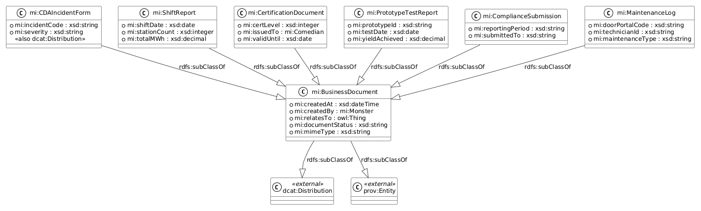
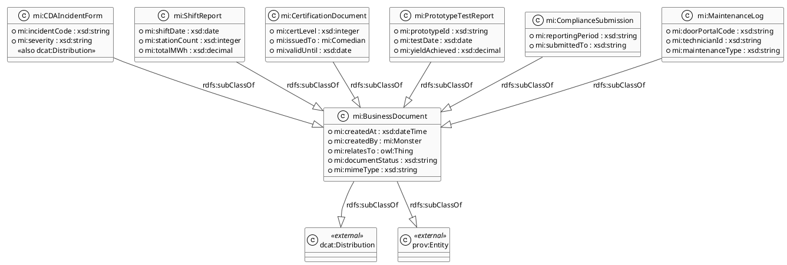
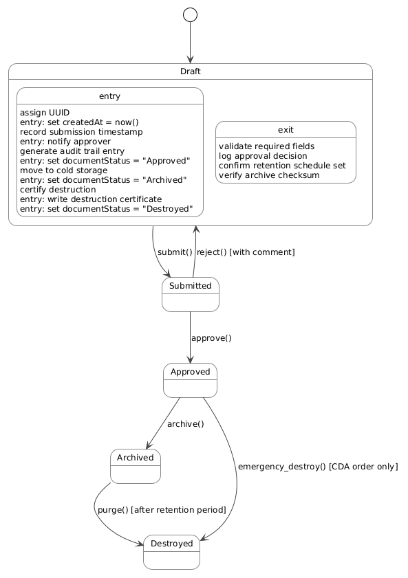
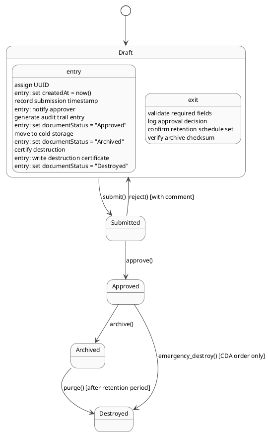

# Unstructured Document Model — Document Ontology

> **View:** Document / Unstructured Content | **Standard:** OWL Document Ontology + DCAT + PROV-O | **Audience:** Records Management, Compliance, Knowledge Engineers

Monsters, Inc. generates a range of formal documents — incident forms, shift reports, certification letters — that sit outside the relational database yet carry legal, operational, and compliance weight. This view defines an OWL document ontology that classifies those artefacts as typed subclasses of `mi:BusinessDocument`, integrates them into the DCAT catalog as `dcat:Distribution` instances, and threads each one into the PROV-O provenance chain so every document can be traced back to the process activity that created it.

**Navigation:** [← 11 DB Schema](11-db-schema.md) | [→ 13 Agent Authority](13-agent-model.md) | [All Views →](../README.md)

---

## Diagram 1: Document Class Hierarchy

<!-- diagram-image -->




---

## Diagram 2: Document Lifecycle State Machine

<!-- diagram-image -->




---

## Document Type Inventory

| Document Type | Process | Domain | Format | Retention | Created By |
|--------------|---------|--------|--------|-----------|------------|
| CDA Incident Form (2319) | P5 | D5 | PDF | 7 years | CDA Monitor |
| Shift Report | P1 | D2 | PDF/JSON | 2 years | Dispatcher |
| Comedian Certification Letter | P4 | D4 | PDF | Duration of employment | HR Platform |
| R&D Prototype Test Report | P7 | D6 | PDF/Markdown | 5 years | Lab System |
| Monthly CDA Compliance Submission | P6 | D5 | PDF/RDF | 7 years | Compliance Gateway |
| Door Maintenance Log | P2 | D3 | JSON/PDF | 3 years | Door Control System |

---

## OWL Document Ontology (Inline Turtle)

```turtle
@prefix mi:    <https://vocab.monstersinc.com/ontology#> .
@prefix owl:   <http://www.w3.org/2002/07/owl#> .
@prefix rdf:   <http://www.w3.org/1999/02/22-rdf-syntax-ns#> .
@prefix rdfs:  <http://www.w3.org/2000/01/rdf-schema#> .
@prefix xsd:   <http://www.w3.org/2001/XMLSchema#> .
@prefix dcat:  <http://www.w3.org/ns/dcat#> .
@prefix prov:  <http://www.w3.org/ns/prov#> .
@prefix dct:   <http://purl.org/dc/terms/> .

# =============================================================================
# Monsters Inc. Document Ontology — inline fragment
# Defines mi:BusinessDocument and its six typed subclasses.
# Full catalog integration: ontologies/mi-catalog.ttl
# Full provenance chain:    ontologies/mi-provenance.ttl
# =============================================================================

# ---------------------------------------------------------------------------
# Superclass
# ---------------------------------------------------------------------------

mi:BusinessDocument a owl:Class ;
    rdfs:label "Business Document" ;
    rdfs:comment "Any formal document produced by a Monsters, Inc. process." ;
    rdfs:subClassOf dcat:Distribution, prov:Entity .

# ---------------------------------------------------------------------------
# Shared properties
# ---------------------------------------------------------------------------

mi:createdAt a owl:DatatypeProperty ;
    rdfs:label "created at" ;
    rdfs:domain mi:BusinessDocument ;
    rdfs:range  xsd:dateTime .

mi:createdBy a owl:ObjectProperty ;
    rdfs:label "created by" ;
    rdfs:domain mi:BusinessDocument ;
    rdfs:range  mi:Monster .

mi:relatesTo a owl:ObjectProperty ;
    rdfs:label "relates to" ;
    rdfs:domain mi:BusinessDocument .

mi:documentStatus a owl:DatatypeProperty ;
    rdfs:label "document status" ;
    rdfs:comment "Lifecycle state: Draft | Submitted | Approved | Archived | Destroyed." ;
    rdfs:domain mi:BusinessDocument ;
    rdfs:range  xsd:string .

mi:mimeType a owl:DatatypeProperty ;
    rdfs:label "MIME type" ;
    rdfs:domain mi:BusinessDocument ;
    rdfs:range  xsd:string .

# ---------------------------------------------------------------------------
# Subclasses
# ---------------------------------------------------------------------------

mi:CDAIncidentForm a owl:Class ;
    rdfs:subClassOf mi:BusinessDocument ;
    rdfs:label "CDA Incident Form (2319)" ;
    rdfs:comment "Filed by a CDA Monitor when a child is exposed to a contamination (2319) event. Also typed as dcat:Distribution." .

mi:incidentCode a owl:DatatypeProperty ;
    rdfs:domain mi:CDAIncidentForm ;
    rdfs:range  xsd:string .

mi:severity a owl:DatatypeProperty ;
    rdfs:domain mi:CDAIncidentForm ;
    rdfs:range  xsd:string .

mi:ShiftReport a owl:Class ;
    rdfs:subClassOf mi:BusinessDocument ;
    rdfs:label "Shift Report" ;
    rdfs:comment "Summarises laugh collection totals and station throughput for a single shift." .

mi:shiftDate a owl:DatatypeProperty ;
    rdfs:domain mi:ShiftReport ;
    rdfs:range  xsd:date .

mi:stationCount a owl:DatatypeProperty ;
    rdfs:domain mi:ShiftReport ;
    rdfs:range  xsd:integer .

mi:totalMWh a owl:DatatypeProperty ;
    rdfs:domain mi:ShiftReport ;
    rdfs:range  xsd:decimal .

mi:CertificationDocument a owl:Class ;
    rdfs:subClassOf mi:BusinessDocument ;
    rdfs:label "Comedian Certification Letter" ;
    rdfs:comment "Issued by HR upon successful completion of a comedy certification level." .

mi:certLevel a owl:DatatypeProperty ;
    rdfs:domain mi:CertificationDocument ;
    rdfs:range  xsd:integer .

mi:issuedTo a owl:ObjectProperty ;
    rdfs:domain mi:CertificationDocument ;
    rdfs:range  mi:Comedian .

mi:validUntil a owl:DatatypeProperty ;
    rdfs:domain mi:CertificationDocument ;
    rdfs:range  xsd:date .

mi:PrototypeTestReport a owl:Class ;
    rdfs:subClassOf mi:BusinessDocument ;
    rdfs:label "R&D Prototype Test Report" ;
    rdfs:comment "Records the outcome of a door prototype trial in the R&D lab." .

mi:prototypeId a owl:DatatypeProperty ;
    rdfs:domain mi:PrototypeTestReport ;
    rdfs:range  xsd:string .

mi:testDate a owl:DatatypeProperty ;
    rdfs:domain mi:PrototypeTestReport ;
    rdfs:range  xsd:date .

mi:yieldAchieved a owl:DatatypeProperty ;
    rdfs:domain mi:PrototypeTestReport ;
    rdfs:range  xsd:decimal .

mi:ComplianceSubmission a owl:Class ;
    rdfs:subClassOf mi:BusinessDocument ;
    rdfs:label "Monthly CDA Compliance Submission" ;
    rdfs:comment "Monthly regulatory filing submitted to the CDA by the Compliance Gateway." .

mi:reportingPeriod a owl:DatatypeProperty ;
    rdfs:domain mi:ComplianceSubmission ;
    rdfs:range  xsd:string .

mi:submittedTo a owl:DatatypeProperty ;
    rdfs:domain mi:ComplianceSubmission ;
    rdfs:range  xsd:string .

mi:MaintenanceLog a owl:Class ;
    rdfs:subClassOf mi:BusinessDocument ;
    rdfs:label "Door Maintenance Log" ;
    rdfs:comment "Structured log of every maintenance event performed on a child bedroom door." .

mi:doorPortalCode a owl:DatatypeProperty ;
    rdfs:domain mi:MaintenanceLog ;
    rdfs:range  xsd:string .

mi:technicianId a owl:DatatypeProperty ;
    rdfs:domain mi:MaintenanceLog ;
    rdfs:range  xsd:string .

mi:maintenanceType a owl:DatatypeProperty ;
    rdfs:domain mi:MaintenanceLog ;
    rdfs:range  xsd:string .

# ---------------------------------------------------------------------------
# Example instance
# ---------------------------------------------------------------------------

mi:IncidentForm_2319_20240315 a mi:CDAIncidentForm ;
    mi:createdAt      "2024-03-15T09:52:00Z"^^xsd:dateTime ;
    mi:documentStatus "Approved" ;
    mi:mimeType       "application/pdf" ;
    mi:incidentCode   "2319-A" ;
    mi:severity       "High" ;
    prov:wasGeneratedBy mi:Act_CDAResponse ;
    dct:isPartOf      mi:CDAIncidentLog .
```

---

## Why This Matters

The document ontology bridges unstructured content — PDFs, JSON logs, certification letters — with the semantic graph, making every formal document a first-class node that can be queried, validated, and reasoned over alongside the operational data it describes. By grounding each document in PROV-O, compliance auditors can trace any `mi:CDAIncidentForm` or `mi:ComplianceSubmission` back to the exact process activity and monster that produced it, satisfying regulatory chain-of-custody requirements without manual record-keeping. The dual typing of `mi:BusinessDocument` as both `dcat:Distribution` and `prov:Entity` ensures that the DCAT catalog, provenance lineage, and records management system all share a single consistent representation of each artefact.

---

## Cross-references

- [04 Ontology BPM](04-ontology-bpm.md) — OBPM activities generate these documents as `prov:wasGeneratedBy` assertions
- [05 Data Catalog](05-data-catalog.md) — DCAT catalog includes these document types as `dcat:Distribution` instances
- [06 Data Lineage](06-data-lineage.md) — each document `prov:wasGeneratedBy` a named process activity, extending the laugh-to-energy provenance chain
