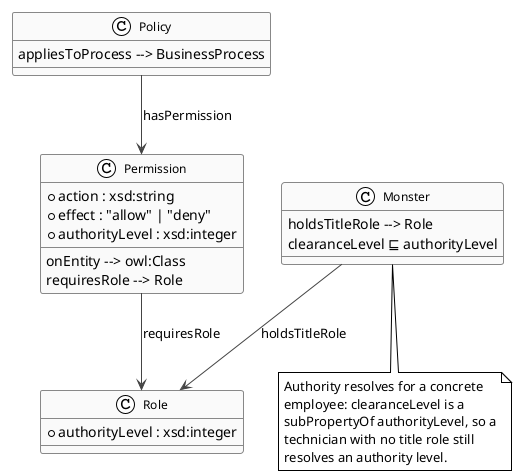
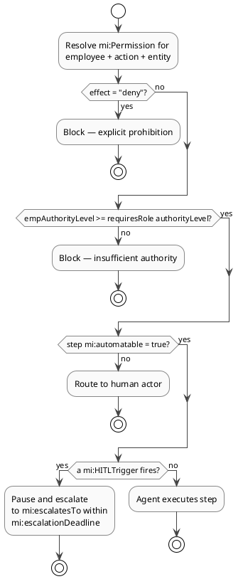

# 13 — Agent Authority & Orchestration

> **View:** Agent Orchestration | **Standard:** OWL 2 + W3C-style authority model + SHACL | **Audience:** AI Platform Engineers, Enterprise Architects, Compliance Officers

This view makes the Monsters, Inc. graph safe for an autonomous agent to act on. It models which actions are permitted on which entities, how an agent resolves a concrete employee's authority, which process steps a machine may execute alone, and exactly when it must pause and escalate to a human.

**Navigation:** [← 12 Unstructured Docs](12-unstructured-docs.md) | [→ 14 Data Governance](14-data-governance.md) | [All Views →](../README.md)

> **Run it:** `make query-agent` — expected: 5 result tables for AA1–AA5; AA4 expected 0 rows (no escalation-coverage gaps).

---

## 1. Policy & Permission Model

A `mi:Policy` bundles `mi:Permission` rules; each permission carries `mi:action`, `mi:effect` (`allow`/`deny`), `mi:onEntity`, `mi:requiresRole` and `mi:authorityLevel`. Before any action an agent resolves the applicable permission for the acting employee. A `deny` permission is an explicit prohibition that overrides authority entirely.



<!-- excerpt-from: ontologies/mi-agent-model.ttl -->
```turtle
mi:Permission a owl:Class ;
    rdfs:label "Permission" ;
    rdfs:comment "A single allow/deny rule scoped to an entity class and requiring a minimum role level." .

mi:action a owl:DatatypeProperty ;
    rdfs:domain mi:Permission ;
    rdfs:range  xsd:string ;
    rdfs:label  "action" ;
    rdfs:comment "The permitted or denied action (e.g. 'read', 'write', 'dispatch', 'escalate')." .
```
[Full file → ../ontologies/mi-agent-model.ttl](../ontologies/mi-agent-model.ttl)

---

## 2. Authority Resolution

`mi:authorityLevel` (integer 1–5) is asserted on each named title-role individual, and `mi:clearanceLevel rdfs:subPropertyOf mi:authorityLevel` bridges door technicians who hold no title role. An agent resolves an employee's authority via `mi:holdsTitleRole`, then compares it against the permission's required level.

<!-- excerpt-from: ontologies/mi-agent-model.ttl -->
```turtle
# Bridge: a DoorTechnician's clearanceLevel (mi-core) IS an authority level, so
# authority resolves for technicians who hold no named title role.
mi:clearanceLevel rdfs:subPropertyOf mi:authorityLevel .

mi:CEO                mi:authorityLevel "5"^^xsd:integer .
mi:CCO                mi:authorityLevel "5"^^xsd:integer .
mi:CDADirector        mi:authorityLevel "4"^^xsd:integer .
mi:VPLogistics        mi:authorityLevel "3"^^xsd:integer .
mi:FloorManagerRole   mi:authorityLevel "3"^^xsd:integer .
```
[Full file → ../ontologies/mi-agent-model.ttl](../ontologies/mi-agent-model.ttl)

---

## 3. Automatable Steps

Every process step carries `mi:automatable` (boolean). `true` means an autonomous agent may execute the step without human approval; `false` makes the step human-only. Physical handling, comedy sessions, certification exams, dismissals and CDA escalations are all `false`.

<!-- excerpt-from: ontologies/mi-agent-model.ttl -->
```turtle
mi:automatable a owl:DatatypeProperty ;
    rdfs:domain mi:ProcessStep ;
    rdfs:range  xsd:boolean ;
    rdfs:label  "automatable" ;
    rdfs:comment "true if this step can be executed by an autonomous agent without human approval; false requires a human actor." .
```
[Full file → ../ontologies/mi-agent-model.ttl](../ontologies/mi-agent-model.ttl)

---

## 4. Human-in-the-Loop Triggers

Three `mi:HITLTrigger` instances force an agent to pause and route to a human. Each declares `mi:escalatesTo` (a Role), `mi:escalationDeadline` (an `xsd:duration`) and `mi:triggeredByStep`, so the agent knows when to fire, to whom and within what window.

| Trigger | Escalates to | Deadline |
|---|---|---|
| `mi:HITL_2319Contamination` | `mi:CDADirector` | `PT30M` |
| `mi:HITL_LowLaughScore` | `mi:FloorManagerRole` | `PT1H` |
| `mi:HITL_HighSeverityIncident` | `mi:CDADirector` | `PT15M` |

<!-- excerpt-from: ontologies/mi-agent-model.ttl -->
```turtle
mi:HITL_2319Contamination a mi:HITLTrigger ;
    rdfs:label "2319 Contamination Alert — Escalate to CDA Liaison" ;
    mi:triggerCondition "A ContaminationAlert is detected at any LaughFloorStation (CDAAlertEvent fires)." ;
    mi:escalatesTo mi:CDADirector ;
    mi:escalationDeadline "PT30M"^^xsd:duration ;
    mi:triggeredByStep mi:SE8a_2319Protocol, mi:P5S1_ContaminationDetected .
```
[Full file → ../ontologies/mi-agent-model.ttl](../ontologies/mi-agent-model.ttl)

---

## 5. The Agent Decision Loop

For each step an agent resolves the permission, checks whether the step is automatable, then evaluates any HITL trigger before acting. Any of three gates — explicit `deny`, a non-automatable step, or a fired trigger — routes the work to a human instead.



---

## 6. Data Classification & Integrity Shapes

`mi:DataClassification` tags entities (`mi:ChildProfile` is `mi:SensitivePersonalData`, `mi:CDAIncident` is `mi:Restricted`). Three SHACL shapes in `shapes/mi-agent.shacl.ttl` keep the model safe to consume: `mi:PermissionShape` (every permission fully specified), `mi:HITLTriggerShape` (every trigger actionable) and `mi:HighSeverityEscalationShape` (severity ≥ 4 incidents must be escalated). A malformed permission is more dangerous than none — an agent might silently proceed without a guard.

<!-- excerpt-from: shapes/mi-agent.shacl.ttl -->
```turtle
mi:PermissionShape a sh:NodeShape ;
    sh:targetClass mi:Permission ;
    sh:name "Permission Completeness Shape" ;

    sh:property [
        sh:path mi:effect ;
        sh:minCount 1 ;
        sh:in ( "allow" "deny" ) ;
        sh:severity sh:Violation ;
        sh:message "Permission effect must be exactly 'allow' or 'deny'."
    ] ;
```
[Full file → ../shapes/mi-agent.shacl.ttl](../shapes/mi-agent.shacl.ttl)

---

## 7. Proof Queries AA1–AA5

The five `agent-authority.sparql` queries let an agent answer its core questions and prove its own governance is complete.

| ID | Question | Headline result |
|---|---|---|
| AA1 | May employee E do action A on entity-class C? | Even the CEO (James P. Sullivan) is **DENY (explicit prohibition)** for `export` of `ChildProfile`. |
| AA2 | Which HITL triggers fire at each step, to whom, by when? | 3 triggers bound to process steps. |
| AA3 | Which steps are agent-executable vs human-only? | Physical, comedy, exam and escalation steps are `false`. |
| AA4 | Are any HITL triggers incomplete? | **0 rows** — no escalation-coverage gaps. |
| AA5 | Who may read `SensitivePersonalData`? | `mi:ChildProfile` read only by `mi:FloorManagerRole`; default-deny otherwise. |

<!-- excerpt-from: queries/agent-authority.sparql -->
```sparql
    ?emp mi:holdsTitleRole ?role ; mi:name ?employee .
    ?role mi:authorityLevel ?empAuth .
    FILTER (?role = ?reqRole)
    BIND(IF(?effect = "deny", "DENY (explicit prohibition)",
         IF(?empAuth >= ?reqAuth, "ALLOW", "DENY (insufficient authority)")) AS ?decision)
```
[Full file → ../queries/agent-authority.sparql](../queries/agent-authority.sparql)

The AA1 result is the load-bearing demonstration: the explicit `deny` permission on `mi:ChildProfile` `export` defeats even authority level 5, so no agent can be talked into exfiltrating children's data by authority alone.

---

## Why this matters

Authority, automatability and human-in-the-loop are modelled as data in the same graph as the operations they govern, so an agent reasons over one source of truth instead of hard-coded policy. The `deny`-overrides-authority rule and the zero-gap escalation self-check (AA4) are what make autonomous action defensible: every action an agent takes can be traced to a permission, an authority comparison and an escalation decision. This is the consumable layer MS IQ ingests to orchestrate safely.

---

## Cross-references

| Related doc | Relationship |
|-------------|-------------|
| [01 — Domain Model](01-domain-model.md) | Defines `mi:Role`, `mi:ChildProfile`, `mi:CDAIncident` and the steps that permissions and triggers reference |
| [03 — Business Process](03-business-process.md) | Source of the `mi:ProcessStep` individuals tagged with `mi:automatable` and bound by HITL triggers |
| [09 — Constraints & Queries](09-constraints-queries.md) | The base SHACL/SPARQL pattern that the agent shapes and AA queries extend |
| [14 — Data Governance](14-data-governance.md) | Consumes `mi:DataClassification` to drive ODRL access and identity controls |
| [15 — Company Constitution](15-constitution.md) | Binds `mi:Prin_HumanOversight` and `mi:Prin_DataMinimisation` to these shapes and AA queries |
