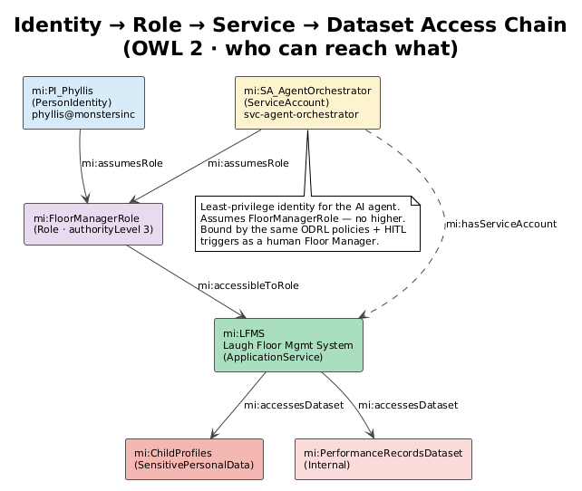
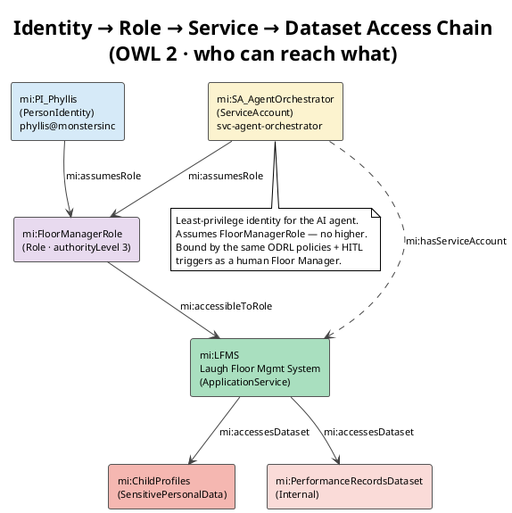
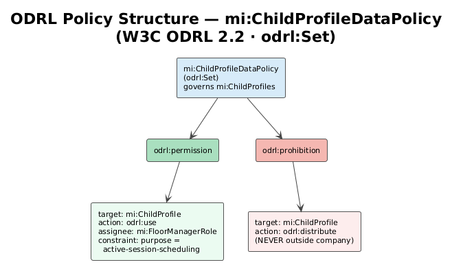
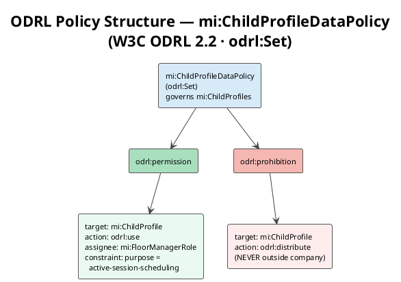

# 14 — Data Governance, Identity & Access

> **View:** Data Governance | **Standard:** OWL 2 + W3C ODRL 2.2 + SHACL | **Audience:** CISO, Data Protection Officer, Platform & Agent Engineers

This view answers, in machine-queryable form, the three questions every access decision turns on: **who** (a person or system identity) may reach **which** systems and data (the service catalog and classified datasets), under **what** rules (W3C ODRL policies). It is the layer the autonomous agent must consult before it reads or moves a single byte — and it binds that agent to exactly the same identity, classification, and policy machinery as a human employee.

**Navigation:** [← 13 Agent Model](13-agent-model.md) | [→ 15 Constitution](15-constitution.md) | [All Views →](../README.md)

> **Run it:** `make query-gov` — expected: GV1–GV6 result tables; GV1 lists person *and* service-account identities (incl. the AI agent) against the services their role can reach; GV6 honestly reports the restricted datasets that still lack an ODRL policy.

---

## 1. Identity Model — People and Machines as First-Class Principals

Every authenticatable principal is an `mi:Identity`, split into `mi:PersonIdentity` (a login bound to a monster employee via `mi:identityFor`) and `mi:ServiceAccount` (a non-human identity a system or agent acts under). Both kinds carry `mi:assumesRole`, so a single access query treats humans and machines uniformly. An identity is explicitly *not* the person — `mi:Identity owl:disjointWith mi:Monster` — it merely represents one.

<!-- diagram-image -->




<!-- excerpt-from: ontologies/mi-governance.ttl -->
```turtle
mi:PI_Phyllis a mi:PersonIdentity ; rdfs:label "phyllis@monstersinc" ;
    mi:identityFor <https://vocab.monstersinc.com/comedian/emp-022> ; mi:assumesRole mi:FloorManagerRole .

# Service accounts — the autonomous agent runs as a least-privilege account
mi:SA_AgentOrchestrator a mi:ServiceAccount ; rdfs:label "svc-agent-orchestrator" ;
    mi:assumesRole mi:FloorManagerRole ;
    rdfs:comment "The AI agent's least-privilege identity. Inherits FloorManager-level authority and is bound by the same ODRL policies and HITL triggers as a human in that role." .
```
[Full file → ../ontologies/mi-governance.ttl](../ontologies/mi-governance.ttl)

The pivotal individual is `mi:SA_AgentOrchestrator`. It assumes `mi:FloorManagerRole` (authority level 3) and **nothing higher**, so it inherits exactly a human floor manager's reach — no more. Crucially, its escalation ceiling is its own role: `mi:HITL_LowLaughScore mi:escalatesTo mi:FloorManagerRole` (see [13 Agent Model](13-agent-model.md)), which means the agent cannot self-approve actions that trip a human-in-the-loop trigger, because the role it would escalate *to* is the role it already holds.

---

## 2. Service Catalog as RDF — Twelve Queryable Services

The service catalog that doc 07 describes in prose is now twelve RDF individuals: six `mi:ApplicationService` (**LFMS, DPCS, ELS, HRCP, CDACG, RDLMS**) and six `mi:TechnologyService` (Portal Network Controller, Energy Grid Integration API, RDF Knowledge Graph Store, SPARQL Query Service, CDA Incident API, Event Streaming Bus). Each application service declares `mi:servesDomain`, `mi:accessibleToRole`, `mi:accessesDataset`, optionally `mi:hasServiceAccount`, and `mi:dependsOn` links into the technology layer — so an agent can resolve "what can this role touch, and through which systems?" with one query (GV1, GV5).

<!-- excerpt-from: ontologies/mi-governance.ttl -->
```turtle
mi:LFMS a mi:ApplicationService ; rdfs:label "Laugh Floor Management System" ;
    mi:servesDomain mi:LaughOperations ; mi:accessibleToRole mi:FloorManagerRole, mi:CCO ;
    mi:accessesDataset mi:PerformanceRecordsDataset, mi:ChildProfiles ; mi:hasServiceAccount mi:SA_AgentOrchestrator ;
    mi:dependsOn mi:RDFKnowledgeGraphStore, mi:EventStreamingBus .
```
[Full file → ../ontologies/mi-governance.ttl](../ontologies/mi-governance.ttl)

Because access is expressed as `mi:accessibleToRole` rather than per-identity grants, the agent's reach is derived automatically from the role it assumes — there is no separate "agent permissions" list to drift out of sync with the human one.

---

## 3. Data Classification — Dataset Level and Column Level

Governance reaches all the way down to individual schema properties. The four classification individuals (`mi:Public`, `mi:Internal`, `mi:Restricted`, `mi:SensitivePersonalData`) and the `mi:dataClassification` property are defined in the agent model; `mi-governance.ttl` applies them to every dataset and to the most sensitive columns. Child-profile attributes (`mi:ageRange`, `mi:bedroomType`, `mi:timezone`) are `mi:SensitivePersonalData`; operational columns such as `mi:employeeId` and `mi:laughScore` are `mi:Internal`. Query GV3 returns this whole inventory.

<!-- excerpt-from: ontologies/mi-agent-model.ttl -->
```turtle
mi:Public              a mi:DataClassification, owl:NamedIndividual ; rdfs:label "Public" .
mi:Internal            a mi:DataClassification, owl:NamedIndividual ; rdfs:label "Internal" .
mi:Restricted          a mi:DataClassification, owl:NamedIndividual ; rdfs:label "Restricted" .
mi:SensitivePersonalData a mi:DataClassification, owl:NamedIndividual ; rdfs:label "Sensitive Personal Data" .
```
[Full file → ../ontologies/mi-agent-model.ttl](../ontologies/mi-agent-model.ttl)

<!-- excerpt-from: ontologies/mi-governance.ttl -->
```turtle
# Column-level (on the schema properties) — the child profile attributes are
# sensitive personal data; performance/employee data is internal.
mi:ageRange     mi:dataClassification mi:SensitivePersonalData .
mi:bedroomType  mi:dataClassification mi:SensitivePersonalData .
mi:timezone     mi:dataClassification mi:SensitivePersonalData .
mi:laughScore        mi:dataClassification mi:Internal .
```
[Full file → ../ontologies/mi-governance.ttl](../ontologies/mi-governance.ttl)

Column-level tagging is what lets a policy say "read the child profile for scheduling, but never these three columns off-site" — a granularity dataset-level labels cannot express.

---

## 4. W3C ODRL Policies — Machine-Enforceable Usage Rules

Three `odrl:Set` policies turn classification into enforceable rules. Each uses standard ODRL rule nodes — `odrl:permission` / `odrl:prohibition` with `odrl:target`, `odrl:action`, `odrl:assignee`, and `odrl:constraint`. `mi:ChildProfileDataPolicy` permits a Floor Manager to `odrl:use` a child profile *only* when the purpose is active-session scheduling, and **prohibits** `odrl:distribute` outright. `mi:EmployeeDataPolicy` grants the Chief People Officer use on the monster registry; `mi:EnergyLedgerPolicy` lets the external `mi:MonstropolisGridAuthority` use and distribute energy units for reconciliation. Query GV4 audits every rule.

<!-- diagram-image -->




<!-- excerpt-from: ontologies/mi-governance.ttl -->
```turtle
    odrl:prohibition [
        odrl:target mi:ChildProfile ;
        odrl:action odrl:distribute ;
        rdfs:comment "Sensitive personal data of children must never be distributed outside the company."
    ] .
```
[Full file → ../ontologies/mi-governance.ttl](../ontologies/mi-governance.ttl)

The prohibition on distributing child data is the single most important rule in the model: it is a hard, machine-readable "never," not a guideline — the agent's `SA_AgentOrchestrator` is subject to it identically to any human.

---

## 5. Governance Queries GV1–GV6

The six queries in `queries/governance.sparql` let an agent or auditor interrogate the model end to end:

| Query | Question it answers |
|-------|---------------------|
| **GV1** | Identity → role → system access: which identities (person *and* service accounts, incl. the agent) can use which services? |
| **GV2** | Which services touch sensitive/restricted datasets, and is that access governed by an ODRL policy? |
| **GV3** | Full data-classification inventory — every classified dataset and column. |
| **GV4** | ODRL policy audit — every permission and prohibition with its target, action, and assignee. |
| **GV5** | Service dependency map — which services depend on which. |
| **GV6** | **Governance gap** — restricted/sensitive datasets with *no* governing policy. |

<!-- excerpt-from: queries/governance.sparql -->
```sparql
# GV6: GOVERNANCE GAP — sensitive/restricted datasets with NO ODRL policy
SELECT (STRAFTER(STR(?ds), "#") AS ?dataset) (STRAFTER(STR(?cls), "#") AS ?classification)
WHERE {
    ?ds a dcat:Dataset ; mi:dataClassification ?cls .
    FILTER (?cls IN (mi:SensitivePersonalData, mi:Restricted))
    FILTER NOT EXISTS { ?ds mi:governedByPolicy ?p }
}
ORDER BY ?dataset
```
[Full file → ../queries/governance.sparql](../queries/governance.sparql)

GV6 is deliberately an **honest self-audit**. `mi:ChildProfiles`, `mi:MonsterRegistry`, and `mi:EnergyLedger` each have a bound ODRL policy, but the restricted datasets `mi:CDAIncidentLog`, `mi:CDAComplianceReports`, and `mi:RDPrototypes` currently do **not** — so GV6 returns them as named control gaps to close, rather than letting the model pretend coverage is complete.

---

## Why this matters

Access control that lives only in application code or a spreadsheet cannot be reasoned over by an autonomous agent — and cannot be audited without trusting that the code matches the policy. By expressing identity, the service catalog, column-level classification, and ODRL usage rules as one connected RDF graph, Monsters, Inc. makes every access decision a query rather than a code path. The same model that authorises a human Floor Manager authorises `SA_AgentOrchestrator`, under the same role ceiling, the same classification labels, and the same hard prohibition on distributing child data — so the agent inherits the company's guardrails by construction instead of by promise. GV6 keeps the model trustworthy by surfacing where governance is still incomplete.

---

## Cross-References

- [13 Agent Model](13-agent-model.md) — defines the `mi:DataClassification` levels, `mi:FloorManagerRole` authority, and the HITL triggers that bound `SA_AgentOrchestrator`
- [07 Service Catalog](07-service-catalog.md) — the prose ArchiMate view of the twelve services now modelled here as queryable RDF individuals
- [05 Data Catalog](05-data-catalog.md) — the DCAT dataset descriptions these policies and classifications attach to
- [09 Constraints & Queries](09-constraints-queries.md) — SHACL shapes and SPARQL that enforce data-quality and compliance constraints alongside these access policies
- [15 Constitution](15-constitution.md) — the company-level principles these governance rules operationalise
