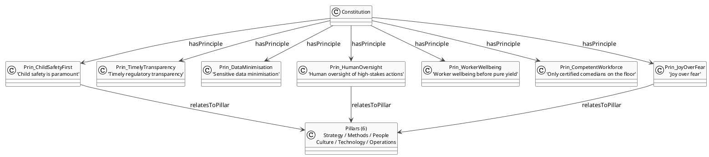
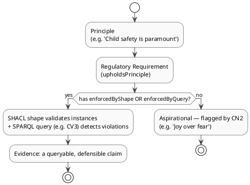

# 15 — Company Constitution & Defensibility

> **View:** Governance / Strategy | **Standard:** OWL 2 + SKOS + SHACL/SPARQL enforcement bindings | **Audience:** Executives, Compliance Officers, Enterprise Architects

The Monsters, Inc. Constitution turns "we comply" from prose into evidence: every principle and regulatory requirement is linked to the exact SHACL shape and SPARQL query that enforces it. It also honestly flags the one commitment that is still aspirational, so the company can never overstate what it can defend.

**Navigation:** [← 14 Data Governance](14-data-governance.md) | [→ All Views / README](../README.md) | [All Views →](../README.md)

> **Run it:** `make query-con` — expected: 4 result tables for CN1–CN4; CN2 lists 'Joy over fear' as the lone un-enforced principle.

---

## 1. Constitution → Principles → Pillars

`mi:MonstersIncConstitution` holds seven `mi:Principle` individuals, each tied via `mi:relatesToPillar` to one or more of the six `mi:Pillar` individuals. The constitution is the post-transition charter committing the company to child safety, transparency, data minimisation, human oversight, worker wellbeing and joy-based operation.



<!-- excerpt-from: ontologies/mi-constitution.ttl -->
```turtle
mi:Pillar_Strategy   a mi:Pillar ; rdfs:label "Strategy" .
mi:Pillar_Methods    a mi:Pillar ; rdfs:label "Methods" .
mi:Pillar_People     a mi:Pillar ; rdfs:label "People" .
mi:Pillar_Culture    a mi:Pillar ; rdfs:label "Culture" .
mi:Pillar_Technology a mi:Pillar ; rdfs:label "Technology" .
mi:Pillar_Operations a mi:Pillar ; rdfs:label "Operations" .
```
[Full file → ../ontologies/mi-constitution.ttl](../ontologies/mi-constitution.ttl)

---

## 2. The Seven Principles

| Principle | Pillar(s) | Enforced by |
|---|---|---|
| Child safety is paramount | Operations, Culture | `mi:CDAReportingShape`, `mi:DoorContaminationShape` + CV3 |
| Timely regulatory transparency | Operations | `mi:CDAReportingShape` + CV3 |
| Sensitive data minimisation | Technology, Culture | `mi:PermissionShape` + AA5 |
| Human oversight of high-stakes actions | Methods, People | `mi:HITLTriggerShape`, `mi:HighSeverityEscalationShape` + AA2 |
| Worker wellbeing before pure yield | People, Culture | HC7 |
| Only certified comedians on the floor | People, Operations | `mi:ComedianCertShape` + CV1 |
| Joy over fear | Culture, Strategy | *(not yet enforced — see §4)* |

---

## 3. The Four Regulatory Requirements

Each `mi:RegulatoryRequirement` is `mi:mandatedByDriver mi:Driver_Regulation`, `mi:upholdsPrinciple` a principle, and carries its own enforcement binding — closing the loop from external obligation to machine-checkable evidence.

| Requirement | Upholds | Enforced by |
|---|---|---|
| CDA Protocol 2319 — report contamination within 30 minutes | Timely transparency; Child safety | `mi:CDAReportingShape` + CV3 |
| Doors must be maintained within 180 days | Child safety | `mi:DoorDispatchShape` + CV2 |
| Severity ≥ 4 incidents must be escalated | Human oversight | `mi:HighSeverityEscalationShape` |
| Children's personal data must be access-controlled and never distributed | Data minimisation | AA5 |

<!-- excerpt-from: ontologies/mi-constitution.ttl -->
```turtle
mi:Reg_2319Reporting a mi:RegulatoryRequirement ;
    rdfs:label "CDA Protocol 2319 — report contamination within 30 minutes" ;
    mi:mandatedByDriver mi:Driver_Regulation ;
    mi:upholdsPrinciple mi:Prin_TimelyTransparency, mi:Prin_ChildSafetyFirst ;
    mi:relatesToPillar mi:Pillar_Operations ;
    mi:enforcedByShape mi:CDAReportingShape ;
    mi:enforcedByQuery "CV3" .
```
[Full file → ../ontologies/mi-constitution.ttl](../ontologies/mi-constitution.ttl)

---

## 4. The Defensibility Chain

A principle is *defensible* only when it carries an `mi:enforcedByShape` and/or `mi:enforcedByQuery` binding. The chain runs principle → regulatory requirement → SHACL shape + SPARQL query → live evidence in the graph. `mi:Prin_JoyOverFear` deliberately carries no binding: CN2 surfaces it as the single aspirational commitment, an honest self-audit rather than an unverifiable claim.



<!-- excerpt-from: ontologies/mi-constitution.ttl -->
```turtle
mi:Prin_JoyOverFear a mi:Principle ;
    rdfs:label "Joy over fear" ;
    skos:definition "Energy is generated through genuine laughter, not fear — the defining cultural shift of the company." ;
    mi:relatesToPillar mi:Pillar_Culture, mi:Pillar_Strategy .
```
[Full file → ../ontologies/mi-constitution.ttl](../ontologies/mi-constitution.ttl)

---

## 5. Defensibility Queries CN1–CN4

| ID | Question | Result |
|---|---|---|
| CN1 | For each principle, which pillar and which enforcing shape/query? | The full principle → pillar → enforcement binding table. |
| CN2 | Which commitments have **no** enforcement binding? | Exactly one row: **"Joy over fear"** — the lone aspirational principle. |
| CN3 | How many principles touch each of the six pillars? | Per-pillar principle counts. |
| CN4 | For each regulatory requirement, which principle and what enforces it? | Full requirement → upheld-principle → shape/query evidence chain. |

<!-- excerpt-from: queries/constitution.sparql -->
```sparql
SELECT ?label
WHERE {
    { ?rule a mi:Principle } UNION { ?rule a mi:RegulatoryRequirement }
    ?rule rdfs:label ?label .
    FILTER NOT EXISTS { ?rule mi:enforcedByShape ?s }
    FILTER NOT EXISTS { ?rule mi:enforcedByQuery ?q }
}
ORDER BY ?label
```
[Full file → ../queries/constitution.sparql](../queries/constitution.sparql)

CN2 is the integrity guarantee: any future principle added without a shape or query binding will immediately appear here, so the constitution cannot quietly drift into making claims it cannot defend.

---

## Why this matters

Most corporate value statements are unverifiable prose. Here every principle is a node bound to the precise SHACL shape and SPARQL query that proves it, so "we comply with CDA Protocol 2319" becomes a query MS IQ can run against live data. The honest treatment of "Joy over fear" — flagged, not faked — is itself a governance feature: the model distinguishes what is enforced from what is merely intended.

---

## Cross-references

| Related doc | Relationship |
|-------------|-------------|
| [09 — Constraints & Queries](09-constraints-queries.md) | Defines `mi:ComedianCertShape`, `mi:CDAReportingShape`, `mi:DoorContaminationShape` and CV1–CV3 that enforce the principles |
| [13 — Agent Model](13-agent-model.md) | Source of `mi:PermissionShape`, `mi:HITLTriggerShape`, `mi:HighSeverityEscalationShape` and AA2/AA5 enforcement bindings |
| [14 — Data Governance](14-data-governance.md) | Operationalises `mi:Prin_DataMinimisation` through access and identity controls |
| [02 — Capability Map](02-capability-map.md) | The six strategic pillars the principles map to via `mi:relatesToPillar` |
